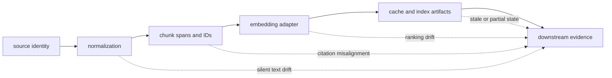

# Architecture Risks

Ingest failures often remain syntactically valid: chunks still exist, vectors
still have numbers, and an index still returns candidates. The dangerous risks
are therefore semantic drift and lost provenance, not only crashes.

## Failure Propagation

A downstream query can succeed after any dotted failure path. Acceptance must
therefore examine identity and provenance, not only whether the final index
loads.

## Risk Register

| Risk | Failure signal | Required control |
| --- | --- | --- |
| unstable source identity | the same source receives different document or chunk IDs | define IDs before processing and retain offsets |
| normalization drift | reprocessing changes text or content keys without an explicit contract change | version normalization and invalidate caches |
| embedding drift | an index loads but ranking changes after a model or numerical change | record model, version, dimension, and fingerprint |
| stale cache reuse | bytes produced under old semantics are accepted as current | rotate cache namespace or version |
| accidental materialization | a streaming workflow exhausts memory on large corpora | retain lazy paths and bound samples/errors |
| process-local HTTP state | an index ID disappears after restart or is unavailable to another worker | use explicit durable index storage |
| partial multi-file publication | chunks and index represent different attempts | publish a fresh run directory only after validation |
| boundary leakage | cleaning, retrieval policy, or credentials move into the wrong layer | enforce dependency direction and capability injection |

## Determinism Can End at an Adapter

Cleaning, chunk spans, stable IDs, and structural deduplication can be
deterministic while embedding is not. A caller that retains only pipeline
configuration but not model and adapter identity cannot reproduce its index.
The artifact must state where the deterministic guarantee ends.

## Local Retrieval Can Obscure Package Ownership

BM25 and NumPy cosine make the package useful by itself, but they can tempt
applications to add governed backend selection, ANN policy, or replay authority
inside ingest. Once retrieval intent and backend capability become first-class
application contracts, move that work to `bijux-canon-index` rather than
expanding the local seam indefinitely.

## Expected Failures Can Be Erased

The `Result` model supports honest partial processing, but careless collectors
can still discard errors or replace failed embeddings with plausible default
vectors. Every continuation policy must preserve error count, stage, source
position, and termination reason. An empty output is not equivalent to a
successfully processed empty corpus.

## Serialization Compatibility Can Drift

JSONL is readable but not self-validating, and MessagePack index files are
opaque without their version envelope. Handwritten readers, manual edits, or
schema copies outside the package can accept data while losing invariant
checks. Use the owned codecs and reject unknown versions.

## Atomic Files Are Not Atomic Runs

Chunk JSONL and cache writes use atomic replacement, but an ingest workflow can
produce several files. No transaction binds input, configuration, chunks,
index, and evaluation output. Use a new directory per material attempt, verify
the index by loading and querying it, then publish the directory as one handoff.

## Sensitive Content Can Escape Through Evidence

Error context, observations, samples, chunks, citations, and traces may contain
source text or metadata. Bound samples, redact secrets at the interface, and
apply access and retention controls to artifacts. Structured observability is
not permission to copy unrestricted content.

The [security guide](../operations/security-and-safety.md) covers operational
controls; [known limitations](../quality/known-limitations.md) records current
package constraints.
