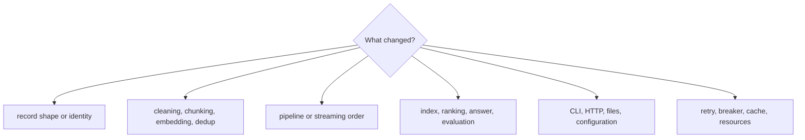

# Code Navigation

The fastest route through ingest is to follow the record being transformed.
Start with its immutable type, move through the owning stage, then inspect the
application or interface that composes the stage.

## Navigate by concern

| Concern | Begin in | Continue in | Evidence |
| --- | --- | --- | --- |
| document, chunk, span, or embedding shape | `src/bijux_canon_ingest/core/` | `interfaces/serialization/` and schemas | unit tests for core types and public API |
| filtering, cleaning, chunking, or dedup | `src/bijux_canon_ingest/processing/` | `application/` for stage assembly | processing and application tests |
| lazy values, fan-in, fan-out, or backpressure | `streaming/`, `fp/`, `result/` | scheduling/effect code used by the pipeline | streaming and property tests |
| embedding choice or vector validation | processing embedder boundary and `retrieval/` | optional integration adapters | embedder-factory and retrieval tests |
| local index, ranking, citations, or evaluation | `retrieval/` | retrieval CLI commands and persisted formats | retrieval unit tests and `tests/e2e/` |
| retry, circuit breaker, memoization, or lifetime | `safeguards/` | application boundary that opts into the policy | focused safeguard tests |
| command behavior | `interfaces/cli/` and CLI entrypoint | configuration and application workflows | CLI smoke and evaluation tests |
| HTTP behavior | HTTP interface models and routes | application and retrieval stores | interface/contract tests and tracked schema |
| optional provider behavior | integration and infrastructure adapters | dependency extras in `pyproject.toml` | focused adapter tests, never default proof |

Paths in this table are relative to
`packages/bijux-canon-ingest/src/bijux_canon_ingest/` unless stated otherwise.

## Follow a document

1. Read the type and identity rules in `core/types.py`.
2. Locate the stage implementation in `processing/`.
3. Find its configured composition in `application/`.
4. Follow serialization or persistence through `interfaces/` and `retrieval/`.
5. Confirm the owning unit test before using an end-to-end test to validate the
   cross-boundary path.

## Public boundary landmarks

| Landmark | Why it matters |
| --- | --- |
| `_package_api.py` | curated package-root exports and public composition surface |
| CLI entrypoint and `typer_argv.py` | dispatch between document-pipeline and retrieval command families |
| `interfaces/` | transport models, serialization, and failure translation |
| package `pyproject.toml` | console entrypoint and optional dependency groups |
| `tests/e2e/test_cli_smoke.py` | file-to-command boundary |
| `tests/e2e/test_eval_suite.py` | persisted retrieval evaluation path |
| `tests/e2e/test_rag_truthfulness_gate.py` | citation and answer-quality acceptance boundary |

When a behavior crosses several rows, place the invariant at the lowest owning
layer and keep interfaces responsible only for translation. This preserves a
short path from failure to cause.
