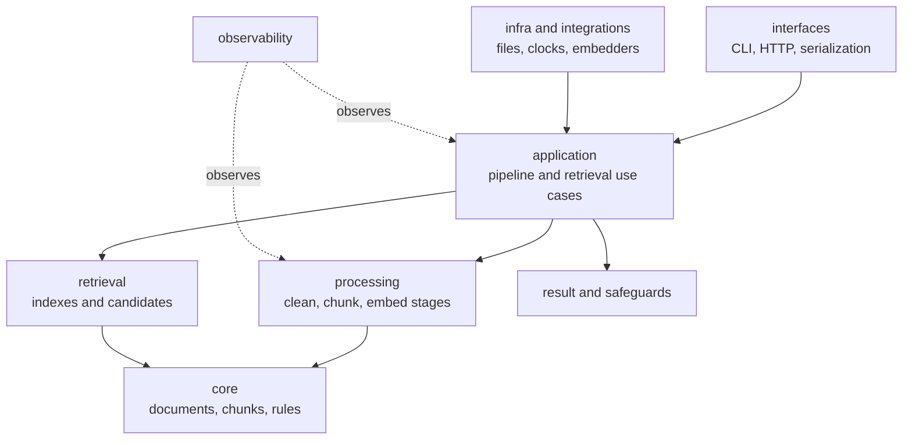

# Dependency Direction

Ingest keeps document semantics at the center and external effects at the
edges. A caller can clean and chunk records without importing the CLI, HTTP
server, filesystem adapters, or model integrations.

The arrows point toward semantic ownership. Boundary code translates input
into package values and invokes use cases; it does not define what a chunk or
retrieval candidate means.

## Inner Contracts

`core` owns immutable document, chunk, tree, and rule types. `processing` owns
deterministic transformations over those values. These modules must remain
usable without FastAPI, CLI parsing, filesystem access, or a particular
embedding provider.

`result`, `streaming`, `fp`, and `tree` provide execution and composition
primitives. They may support the processing model, but they must not import
delivery interfaces or select operational policy on behalf of callers.

## Application Composition

`application` combines inner behavior into use cases:

- document ingestion and materialized observations;
- configured and distributed pipeline definitions;
- index construction, persistence, retrieval, and answering;
- evaluation and service-level payloads.

Application code depends on capability contracts and receives effectful
behavior through dependencies. It may coordinate storage or embedding, but it
must not hide a concrete adapter inside the meaning of a core transform.

## Boundary Dependencies

`interfaces` owns CSV, JSONL, MessagePack, CLI, and HTTP translation. `infra`
and `integrations` own implementations for files, atomic storage, clocks,
embedders, models, and vector systems. They are allowed to depend inward on
application and domain contracts.

The reverse direction is a design defect. Examples include:

- `processing` importing an HTTP request model;
- a core chunk type importing NumPy solely for one adapter;
- application orchestration constructing a provider client from environment
  variables instead of receiving a capability;
- serialization details becoming required fields on internal domain values.

## The Retrieval Exception Is Local, Not Global

The package includes BM25 and NumPy-cosine retrieval so ingestion workflows can
be self-contained. That implementation depends on prepared chunk contracts and
remains ingest-local. It does not authorize `bijux-canon-ingest` to become the
governed vector-execution layer owned by `bijux-canon-index`.

## Import Stability

The package root exposes a curated dependency-light API and lazily resolves
heavier compatibility exports. New code should import boundary-specific
features from their owned modules. Adding an eager adapter import to the root
can turn an optional integration into a mandatory installation dependency and
is therefore an architecture change, not a convenience edit.

Use the [module map](module-map.md) to locate ownership and the
[integration seams](integration-seams.md) to choose an edge contract.
