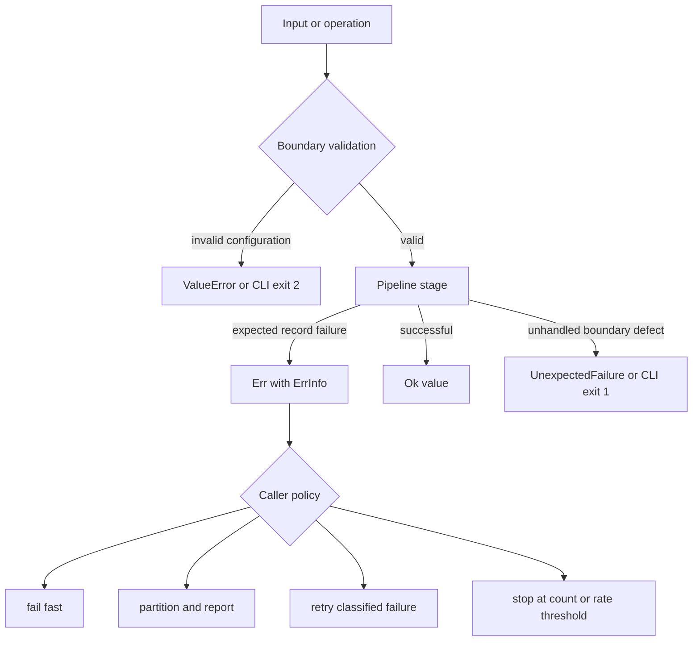

# Error Model

Ingest separates invalid configuration, rejected records, adapter failures, and
unexpected defects. That distinction determines whether a caller repairs the
whole run, isolates one source, retries an external dependency, or stops.

## Failure forms

| Form | Meaning | Caller action |
| --- | --- | --- |
| `ValueError` or `TypeError` | A configuration, invariant, or pipeline composition is invalid | Repair before processing records |
| `Err[T, E]` | An expected operation failed without losing stream control | Inspect or transform the error explicitly |
| `ErrInfo` | Per-record failure with `code`, `msg`, `stage`, position `path`, optional cause, and immutable context | Preserve provenance through collection and reporting |
| validation accumulation | Several independent field or chunk errors were found | Present the complete rejected-input report |
| `UnexpectedFailure` | Exception-oriented interface code encountered a failure outside its expected mapping | Stop and investigate the boundary defect |

`ErrInfo.path` identifies position in a nested or streamed input, not a
filesystem path. `ctx` can carry retry attempt and policy data, but it must not
contain secrets or unrestricted source content.

## Configuration fails before data

`RagEnv` validates positive chunk size, non-negative sample size, overlap
smaller than chunk size, and the tail policy. `PipelineConfig` must contain at
least one step. Pipeline construction rejects unknown steps, incompatible step
order, invalid parameter types, artifact/configuration collisions, and a flow
that does not end at the effectful embedding boundary.

These failures apply to the run as a whole. Converting them into one error per
document would imply that other records can succeed under an invalid pipeline.

## Record and adapter failures

Pure transforms return values or raise invariant errors at construction.
Effectful stages translate expected exceptions into `ErrInfo` at the owning
stage. Embedding dimensionality mismatch, invalid chunks, storage failure, and
retrieval rejection therefore remain distinguishable from an empty result.

Collectors make continuation policy explicit:

- `fold_results_fail_fast` stops at the first error;
- `partition_results` and `collect_both` retain successes and failures;
- capped collectors bound retained error detail;
- error-rate folds and circuit breakers stop unhealthy streams;
- retry helpers annotate attempts and restore input order when requested.

Recovery must produce a value whose meaning is valid for the downstream stage.
Replacing a failed embedding with a zero vector or a failed index load with an
empty index conceals the failure and is not a safe recovery.

## Interface semantics

The pipeline CLI uses exit `2` for argument or configuration errors, exit `1`
for processing and adapter failure, and exit `0` for success. The HTTP adapter
uses `422` for request validation, `404` for an unknown process-local index,
and `400` for a rejected ingest or retrieval operation. Error responses must
not be interpreted as successful empty corpora.

## Crossing package boundaries

Pass stable chunks, indexes, candidates, and structured failures to downstream
packages. Do not convert an ingest failure into an index miss, unsupported
claim, agent veto, or runtime policy violation. The package that first breaks
its contract owns the failure description.
