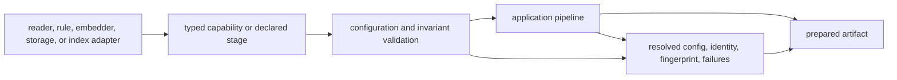

# Extensibility Model

Ingest is extended through typed capabilities, configured transformation
stages, and boundary adapters. An extension is compatible only when it
preserves document identity, ordering, failure semantics, and enough metadata
to explain the resulting artifact.

## Extension path

Direct imports into a pipeline are not an extension model. The seam must make
the capability and its evidence obligations visible to callers.

## Supported extension points

| Seam | Suitable extensions | Required contract |
| --- | --- | --- |
| Source and storage | readers for databases, object stores, or application records; alternate chunk sinks | Emit typed documents, preserve order and source identity, use structured failures, and avoid hidden normalization |
| Cleaning and filtering | named pure cleaning rules and safe document predicates | Be deterministic for declared inputs, preserve rule order, and expose the resolved rule configuration |
| Chunking | domain-aware segmentation behind the chunk contract | Produce valid ordered offsets, stable indices, parent identity, and an explicit tail policy |
| Embedding | local or remote model adapters | Declare model identity, version, dimension, metric, normalization, numerical posture, and retry behavior |
| Local retrieval | an index codec or backend appropriate to ingest-local use | Version its format, validate compatibility, fingerprint the corpus and configuration, and return ordered typed candidates |
| Safeguards | cache, retry, breaker, rate, and bounded-stream policies | Remain explicit application resources with bounded behavior and observable failure classification |

Configured pipelines currently compose the declared `clean`, `chunk`, and
`embed` stages. Adding a stage is a configuration-language change as well as a
code change: its input and output types, ordering rules, parameters, and failure
behavior become part of the public contract.

## Non-extension boundaries

Extensions must not:

- invent or rewrite source identity without an explicit mapping artifact;
- treat an empty result as equivalent to a rejected or failed input;
- replace normalized-string offsets with source-byte claims;
- hide a model change behind an unchanged adapter or artifact identity;
- use unrestricted expression evaluation for dynamic filtering;
- turn the process-local HTTP index registry into an implied durable store;
- absorb governed vector execution, claim verification, workflow authority, or
  final run acceptance from downstream packages.

## Compatibility obligations

Before an extension can produce trusted artifacts, establish:

1. **Identity:** define how document IDs, chunk IDs, offsets, and metadata are
   preserved or deliberately transformed.
2. **Determinism:** identify every source of ordering, randomness, remote state,
   model variation, and numerical variation.
3. **Failure:** map validation, adapter, transient, partial, and terminal
   failures into the package's typed result semantics.
4. **Evidence:** retain the resolved secret-free configuration, implementation
   identity, dependency/model versions, fingerprints, and rejection report.
5. **Round trip:** verify serialization and loading through package codecs,
   including incompatible-version refusal.
6. **Boundary:** demonstrate that downstream semantic or run authority has not
   moved into the adapter.

The [configuration surface](../interfaces/configuration-surface.md) defines
which choices alter artifact meaning. [Artifact contracts](../interfaces/artifact-contracts.md)
define what must survive the extension boundary.
