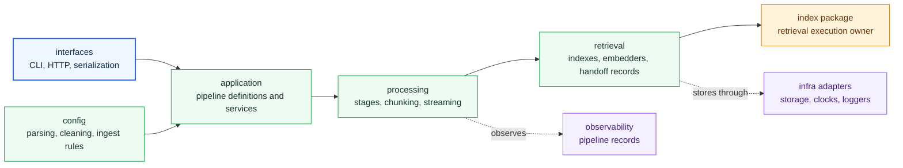

# Architecture

Open this section when the question is structural: where ingest logic lives, how preparation flows through modules, and where the package stops before retrieval semantics take over.

## Structural Shape

Ingest architecture is a preparation pipeline with explicit adapters at the
edges. Source material enters through interface code, application workflows
assemble the run, processing modules normalize and chunk content, and retrieval
modules shape handoff records without becoming the long-term owner of search
semantics.

## Read These First

- open [Module Map](https://bijux.io/bijux-canon/02-bijux-canon-ingest/architecture/module-map/) first when you need the fastest route from a behavior question to the owning code area
- open [Execution Model](https://bijux.io/bijux-canon/02-bijux-canon-ingest/architecture/execution-model/) when you need the real path from source input to prepared output
- open [Integration Seams](https://bijux.io/bijux-canon/02-bijux-canon-ingest/architecture/integration-seams/) when a change could blur the handoff into downstream packages

## Structural Risk

The main architectural risk here is letting preparation behavior leak into retrieval behavior because the handoff seam is weak or poorly named.

## First Proof Check

- `packages/bijux-canon-ingest/src/bijux_canon_ingest/application` for pipeline assembly and services
- `packages/bijux-canon-ingest/src/bijux_canon_ingest/processing` for core preparation flow
- `packages/bijux-canon-ingest/src/bijux_canon_ingest/retrieval` for handoff-ready assembly
- `packages/bijux-canon-ingest/tests` for proof that the structure still defends deterministic preparation

## Pages In This Section

- [Module Map](https://bijux.io/bijux-canon/02-bijux-canon-ingest/architecture/module-map/)
- [Dependency Direction](https://bijux.io/bijux-canon/02-bijux-canon-ingest/architecture/dependency-direction/)
- [Execution Model](https://bijux.io/bijux-canon/02-bijux-canon-ingest/architecture/execution-model/)
- [State and Persistence](https://bijux.io/bijux-canon/02-bijux-canon-ingest/architecture/state-and-persistence/)
- [Integration Seams](https://bijux.io/bijux-canon/02-bijux-canon-ingest/architecture/integration-seams/)
- [Error Model](https://bijux.io/bijux-canon/02-bijux-canon-ingest/architecture/error-model/)
- [Extensibility Model](https://bijux.io/bijux-canon/02-bijux-canon-ingest/architecture/extensibility-model/)
- [Code Navigation](https://bijux.io/bijux-canon/02-bijux-canon-ingest/architecture/code-navigation/)
- [Architecture Risks](https://bijux.io/bijux-canon/02-bijux-canon-ingest/architecture/architecture-risks/)

## Leave This Section When

- leave for [Interfaces](https://bijux.io/bijux-canon/02-bijux-canon-ingest/interfaces/) when the structural question is already a public contract question
- leave for [Operations](https://bijux.io/bijux-canon/02-bijux-canon-ingest/operations/) when the issue is running, diagnosing, or releasing the package rather than explaining its shape
- leave for [Quality](https://bijux.io/bijux-canon/02-bijux-canon-ingest/quality/) when the structure is clear and the real question is whether the package has proved it strongly enough

## Bottom Line

A structure that cannot be explained in one pass is already carrying too much hidden policy.
