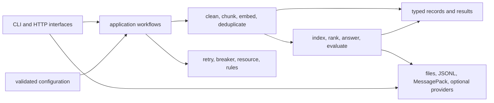

# Architecture

The ingest architecture separates stable domain records from pipeline
assembly, edge adapters, and optional integrations. A caller can use the
document pipeline, the retrieval commands, or the HTTP surface without making
the domain layer depend on those entrypoints.

## Dependency shape

```mermaid
flowchart LR
    edges["CLI and HTTP interfaces"]
    app["application workflows"]
    config["validated configuration"]
    processing["clean, chunk, embed, deduplicate"]
    retrieval["index, rank, answer, evaluate"]
    safeguards["retry, breaker, resource, rules"]
    adapters["files, JSONL, MessagePack, optional providers"]
    records["typed records and results"]

    edges --> app
    config --> app
    app --> processing --> retrieval
    app --> safeguards
    processing --> records
    retrieval --> records
    retrieval --> adapters
    edges --> adapters
```

The arrows describe orchestration dependencies. Typed records and explicit
results carry data across boundaries; interfaces translate external input and
failure into those contracts. Optional providers remain adapters rather than
becoming requirements of the core preparation path.

## Execution shapes

### Document preparation

The configured pipeline reads source rows, validates fields, normalizes text,
assigns identity, chunks content, optionally embeds and deduplicates it, then
writes inspectable output. This is the package's preparation authority.

### Local retrieval

The retrieval command group builds a persisted local index, loads its chunk
records, ranks candidates, and produces extractive answers or evaluation
results. BM25 and NumPy cosine are separate index implementations behind a
common local workflow; their scores are not interchangeable measures.

### HTTP service

The HTTP adapter exposes health, chunking, index construction, retrieval, and
answering. Its default store is memory-backed, so process restart and
multi-worker deployment change state availability unless an application adds
an explicit persistence boundary.

## Module ownership

| Area | Owns |
| --- | --- |
| `core` and `result` | records, identifiers, options, results, and failure values |
| `config` | environment and file configuration parsing and validation |
| `processing` | preparation stages and deterministic content transforms |
| `application` | use-case assembly without transport policy |
| `retrieval` | local indexes, ranking, extractive answers, and evaluation |
| `interfaces` | CLI, HTTP, serialization, and external error translation |
| `safeguards`, `streaming`, and `fp` | bounded execution, stream composition, and functional primitives |
| `infra` and integrations | storage and optional third-party adapters |

## Architectural invariants

- Stable record types cross layers; transport objects do not become the domain
  model by accident.
- Configuration is resolved before work begins and can be represented in run
  evidence.
- Optional integrations fail at their boundary rather than silently changing
  the default execution path.
- Persisted index metadata and chunk data remain paired; loading only one is
  not a valid recovery strategy.
- Citation identifiers resolve to the exact chunk set used to construct the
  answer.

## Navigate the architecture

| Need | Guide |
| --- | --- |
| Locate an implementation owner | [Module map](module-map.md) |
| Follow a complete run | [Execution model](execution-model.md) |
| Understand allowed dependency direction | [Dependency direction](dependency-direction.md) |
| Inspect persisted and process-local state | [State and persistence](state-and-persistence.md) |
| Add or replace an adapter | [Integration seams](integration-seams.md) and [Extensibility model](extensibility-model.md) |
| Trace failures across layers | [Error model](error-model.md) |
| Review known structural hazards | [Architecture risks](architecture-risks.md) |
