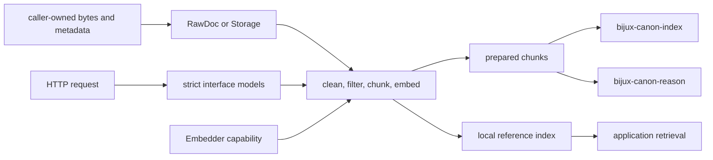
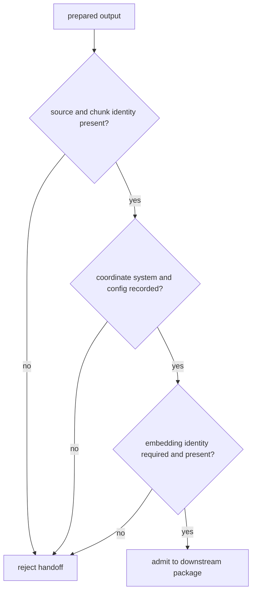

# Integration Seams

Ingest is the boundary where external material acquires canonical identity,
normalized text, chunk coordinates, and embedding context. A safe integration
preserves those decisions as data. It does not ask downstream packages to
reconstruct them from filenames, logs, or vector length.

## Handoff Map

The left side is caller authority: source acquisition, access, licensing, and
raw identity. The package owns transformation semantics in the middle. The
right side receives explicit artifacts and provenance, not an ingest process
handle.

## Seam Contracts

| Seam | Caller supplies | Ingest returns | Integration must preserve |
| --- | --- | --- | --- |
| Python values | `RawDoc` values or already-owned text | `CleanDoc`, `ChunkWithoutEmbedding`, `Chunk`, or `Result` | document identity, normalized offsets, metadata, error context |
| storage capability | ordered document reads and a writable destination | typed values and adapter outcomes | order, field meaning, row position, atomic publication behavior |
| embedder capability | text-to-vector implementation | vectors associated with chunks | provider, model revision, dimension, normalization, numerical posture |
| CLI | paths, configuration, and selected command | JSONL, index artifacts, JSON output, and exit status | stdout/stderr separation, exit category, destination generation |
| HTTP | strict request envelope | chunks, index identity, candidates, citations, or structured failure | process boundary, request identity, response schema version |
| downstream package | prepared records and artifact identity | no implicit callback into ingest | chunk identity, coordinate system, configuration and index fingerprints |

## Choose The Narrowest Entry

Use `clean_doc` and `chunk_doc` when the caller already owns IO and needs pure
transformations. Use application services when indexing, persistence,
retrieval, or extractive answering is one declared use case. Use the CLI at a
process boundary. Use HTTP when request isolation and schema validation are
needed inside a service deployment.

Expected domain failures remain `Result` values in the Python workflows. The
caller chooses fail-fast, partition, retry, or bounded aggregation. Converting
an error to an empty collection destroys the distinction between “no chunks”
and “preparation failed.”

## Adapter Obligations

A `Storage` adapter may acquire and publish values; it must not silently clean
text, invent source identity, reorder records, or discard a row error.
`FileStorage` reads CSV into `RawDoc` values and publishes chunk JSONL using a
temporary file, flush, `fsync`, and atomic replacement.

An embedder adapter may translate text into vectors; it must not redefine chunk
identity or hide the meaning of the vector space. Dimension validation catches
shape mismatch, not semantic model drift. Bind model identity and normalization
to the artifact even when the adapter name is unchanged.

## Serialization And Service Boundaries

JSONL is the prepared-record interchange. Versioned MessagePack envelopes
carry local BM25 and NumPy-cosine reference indexes. Load them through package
codecs so schema checks and fingerprints remain active.

The HTTP API provides health, chunking, index build, retrieval, and extractive
answering. Its index registry is in memory. An `index_id` belongs to that
application process and is neither durable nor shared automatically across
workers. Cross-process use requires persisted index artifacts or an
application-owned durable service.

## Downstream Admission

`bijux-canon-index` begins when backend capability, retrieval intent, budgets,
and replay become governed execution. `bijux-canon-reason` begins when prepared
content becomes addressable evidence for claims. Agent and runtime begin only
when orchestration or whole-run authority is required.

See [data contracts](../interfaces/data-contracts.md) for value semantics and
[artifact contracts](../interfaces/artifact-contracts.md) for serialized
handoffs.
