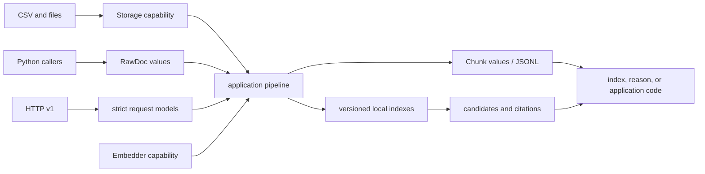

# Integration Seams

Ingest integrations enter through typed documents and capability boundaries,
then leave through prepared records, local indexes, candidates, or structured
errors. Each seam preserves source identity so downstream systems do not need
to reconstruct provenance from filenames or logs.

## Seam Map

## Python Seam

Use `RawDoc`, `CleanDoc`, `ChunkWithoutEmbedding`, and `Chunk` when the caller
already owns IO. Pure functions such as `clean_doc` and `chunk_doc` are the
narrowest seam and carry no server or storage lifecycle.

Use application services when the caller needs indexing, persistence,
retrieval, or answering as one use case. Expected failures remain `Result`
values, allowing the caller to choose fail-fast, partition, retry, or bounded
collection behavior.

## Storage Seam

The `Storage` capability separates document and chunk semantics from files.
`FileStorage` reads CSV rows into `RawDoc` values and writes chunk JSONL through
a temporary file, flush, `fsync`, and atomic replacement. Alternative storage
must preserve ordering, field meaning, and structured failure context.

A storage adapter must not normalize text, invent identifiers, or swallow a
row failure. Those actions belong to processing or caller policy.

## Embedding Seam

Embedding is the principal repeatability boundary. The pipeline accepts an
embedder capability; deterministic local hashing and external model adapters
share that contract. A production integration should bind model identity,
version, dimensionality, normalization, and numerical posture to the resulting
index artifact.

Returning the correct vector length is necessary but insufficient for replay.
Changing a model behind the same adapter name changes retrieval semantics.

## CLI and Serialization Seams

The `bijux-canon-ingest` command translates CSV, configuration, paths, and
arguments into application calls. JSONL carries prepared chunks. Versioned
MessagePack envelopes carry local BM25 and NumPy-cosine indexes. Consumers
should load these formats through package codecs rather than duplicate their
schema.

CLI exit status distinguishes input/configuration errors from processing or
adapter failures. Automation must preserve that distinction instead of treating
every non-zero outcome as an empty corpus.

## HTTP Seam

The v1 FastAPI surface provides health, chunking, index build, retrieval, and
extractive answering. Its index registry is process-local: an `index_id`
created in one process is not automatically durable or visible to another.
Use explicit persisted indexes or an application-owned service layer when
cross-process continuity is required.

## Downstream Handoff

Downstream packages should receive stable chunk identity, offsets, metadata,
index fingerprints, candidates, citations, and structured failures. They should
not receive an opaque provider client or rely on ingest logs as provenance.

- `bijux-canon-index` begins where retrieval execution needs governed backend,
  intent, and replay contracts.
- `bijux-canon-reason` begins where evidence becomes claims and verification.
- agent and runtime begin where orchestration and execution authority matter.

See [data contracts](../interfaces/data-contracts.md) and
[artifact contracts](../interfaces/artifact-contracts.md) for serialized
handoffs.
