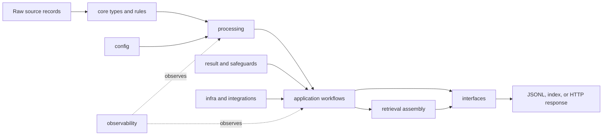

# Module Map

`bijux-canon-ingest` owns the path from untrusted source records to stable,
retrieval-ready chunks. Its architecture keeps pure document transformations
separate from orchestration, optional adapters, and delivery interfaces so a
caller can adopt only the boundary it needs.



The arrows describe dependency and data flow, not a requirement to use every
layer. A library caller can use `RawDoc`, `clean_doc`, and `chunk_doc` without
loading the CLI, FastAPI, storage, or embedding adapters.

## Ownership by module

| Module | Owns | Use it when |
| --- | --- | --- |
| `core` | Immutable document and tree types, predicates, safe rule parsing, and structural deduplication | Defining source identity, selection rules, or ingest invariants |
| `processing` | Cleaning, chunk spans, chunk materialization, embedding boundaries, and deterministic stage composition | Transforming records directly or building a custom pipeline |
| `application` | End-to-end ingest, configured pipelines, indexing, evaluation, and service orchestration | Running a complete use case rather than one transform |
| `retrieval` | Ingest-local indexes, candidates, filters, reranking, citations, and artifact codecs | Building or querying the package's self-contained retrieval path |
| `interfaces` | Console commands, CSV/JSONL codecs, strict HTTP models, and the FastAPI v1 adapter | Crossing a process or network boundary |
| `infra` and `integrations` | Filesystem, vector, model, embedding, and other optional adapters | Connecting pure workflows to external capabilities |
| `result` | Typed success and failure values, collection, partitioning, and recovery | Making expected stage failures explicit in a stream |
| `safeguards` | Retry policy, circuit breakers, resource lifetimes, memoization, and error reports | Bounding operational risk around effectful work |
| `streaming`, `fp`, and `tree` | Lazy stream combinators, effect composition, and tree folds | Extending the execution model without hiding evaluation order |
| `observability` | Taps, traces, probes, and observation configuration | Recording behavior without changing stage results |
| `config` | Validated configuration objects and cleaner construction | Sharing stable configuration across callers |

## The transformation boundary

The central data progression is explicit:

```text
RawDoc -> CleanDoc -> ChunkWithoutEmbedding -> Chunk
```

Cleaning normalizes the reader-visible text fields. Chunking attaches source
identity and character offsets. Embedding is an effect boundary: external
embedders can affect repeatability, while chunk identity is derived from stable
document identity, offsets, and text. Observability taps may inspect these
values but must not mutate or replace them.

## Where neighboring packages begin

Ingest can build a local BM25 or cosine index so a document pipeline can be
used on its own. It does not own the governed execution contract of
`bijux-canon-index`, evidence-backed reasoning in `bijux-canon-reason`, agent
lifecycle policy, or runtime replay authority. Move to those packages when the
problem changes from preparing source material to governing retrieval,
reasoning, orchestration, or execution history.

## Source and proof

- [`processing`](https://github.com/bijux/bijux-canon/tree/main/packages/bijux-canon-ingest/src/bijux_canon_ingest/processing) contains the deterministic document stages.
- [`application`](https://github.com/bijux/bijux-canon/tree/main/packages/bijux-canon-ingest/src/bijux_canon_ingest/application) composes package workflows.
- [`interfaces`](https://github.com/bijux/bijux-canon/tree/main/packages/bijux-canon-ingest/src/bijux_canon_ingest/interfaces) owns CLI, serialization, and HTTP edges.
- [`tests`](https://github.com/bijux/bijux-canon/tree/main/packages/bijux-canon-ingest/tests) exercises import isolation, transformations, adapters, and public contracts.
