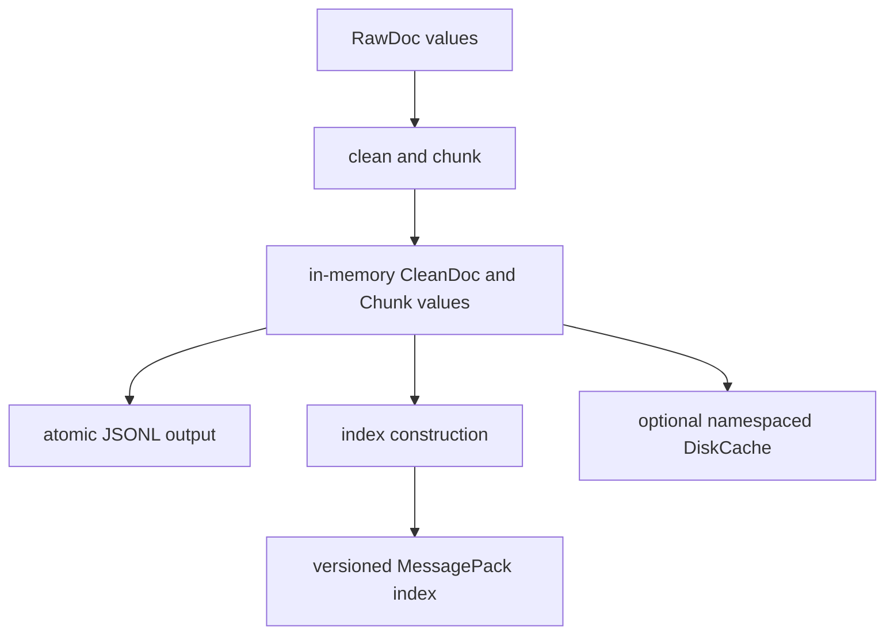

# State and Persistence

Most ingest transformations are pure: documents enter as values and prepared
records leave as values. Persistence appears only at explicit filesystem,
cache, or index boundaries chosen by the caller.

## State Model

The library does not select a global data directory. CLI flags and application
calls receive paths explicitly, so retention, permissions, backup, and cleanup
remain deployment decisions.

## Durable Formats

| State | Format | Write behavior | Identity or version signal |
| --- | --- | --- | --- |
| prepared chunks | UTF-8 JSON Lines | temporary file, flush, `fsync`, atomic replace | document ID, chunk index, offsets, metadata |
| BM25 index | MessagePack | written to the caller's path | schema version and index fingerprint |
| NumPy cosine index | MessagePack | written to the caller's path | schema version, embedding data, and index fingerprint |
| disk cache entry | arbitrary bytes | temporary sibling followed by atomic replace | namespace, cache version, SHA-256 key filename |

Index fingerprints bind the persisted representation to its content and build
configuration. Loading detects the serialized backend and reconstructs a
`StoredIndex` with its backend and fingerprint; unknown or invalid data is
returned as an error by the application service.

## Atomicity and Failure Scope

Prepared JSONL and cache entries use replace-based writes so readers do not see
a partially written target under normal same-filesystem operation. An index is
saved through its backend serializer; callers should write it to a controlled
location and treat a failed save as an unusable artifact.

Atomic replacement protects one file. It does not create a transaction across
chunks, indexes, configuration, and downstream records. When these artifacts
must move together, write them into a fresh run directory and publish that
directory only after every required file has succeeded.

## Cache Semantics

`DiskCache` stores bytes and leaves serialization to its caller. Cache filenames
combine a namespace, a caller-supplied version, and a SHA-256 digest of the key.
Changing transformation or serialization semantics therefore requires a new
cache version or namespace; otherwise old bytes remain valid from the cache's
point of view.

`content_hash_key` normalizes chunk text and includes a normalization version
before computing a BLAKE2b digest. It deliberately identifies content, not an
entire pipeline execution.

## Operational Guidance

- Put command output under a caller-owned directory such as
  `artifacts/ingest/<run-id>/`.
- Preserve the pipeline configuration alongside exported chunks and indexes
  when reproducibility matters.
- Do not edit MessagePack index files by hand; rebuild from source material.
- Rotate cache namespaces when normalization, embedding, or serialization
  semantics change.
- Validate an index by loading and querying it before treating it as a durable
  handoff.

The [artifact contracts](../interfaces/artifact-contracts.md) define the
reader-visible fields and compatibility expectations for these formats.
