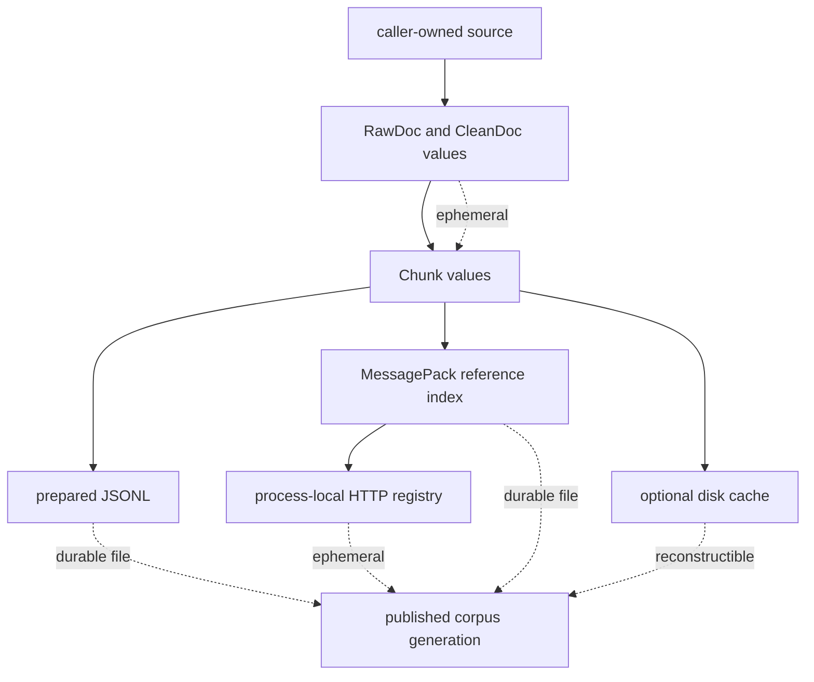
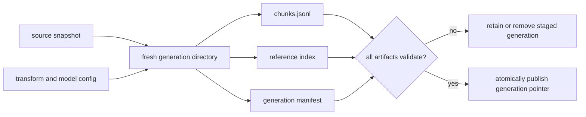

# State and Persistence

Ingest transformations are predominantly value-to-value operations.
Durability appears only where the caller selects a file, cache, index, or
service boundary. This keeps retention visible, but it also means that a
collection of individually valid files is not automatically one coherent
corpus generation.

## State Classes

| State | Lifetime | Identity | Recovery posture |
| --- | --- | --- | --- |
| Python documents and chunks | process or iterator lifetime | document and chunk IDs, normalized offsets | rerun from retained source and configuration |
| canonical corpus snapshot | caller-selected publication root | snapshot, relation, and content-object SHA-256 identities | verify active manifest, generation, relation, and every reachable object; otherwise recover the previous valid generation |
| prepared JSONL | caller-controlled file lifetime | per-record identity plus generation metadata supplied by caller | validate, or rebuild the complete generation |
| BM25 or NumPy-cosine index | caller-controlled file lifetime | schema version and index fingerprint | load and validate; rebuild from prepared records on failure |
| disk cache entry | configured cache retention | namespace, caller version, SHA-256 key filename | evict and recompute |
| HTTP index registry | application-process lifetime | `index_id` derived from index fingerprint | rebuild or reload after restart |

The library does not select a global data directory. Paths, permissions,
backup, cleanup, and retention are deployment decisions.

## File Commit Boundaries

Prepared JSONL and cache entries publish through a temporary sibling and atomic
replacement on the same filesystem. This prevents ordinary readers from
seeing a partially written target. It does not make a transaction across
prepared records, index files, configuration, observations, and downstream
registrations.

For a multi-artifact corpus, write into a fresh generation directory. Record
source and normalized digests, transformation configuration, embedder identity,
schema versions, index fingerprint, counts, and terminal observations. Validate
every required artifact before changing the application-visible generation
pointer.

`corpus build --publish-root` implements that boundary for canonical ingest.
It stores the exact source bytes, canonical snapshot, parser and metadata
manifests, citation-lineage graphs, normalized mappings, and semantic chunks as
SHA-256-addressed objects. A content-addressed relation binds those objects to
one snapshot identity. Publication serializes writers, persists and verifies
the objects, relation, and immutable generation, and replaces `active.json`
last. Readers consequently observe the prior complete generation until the new
one is fully durable. Repeating the same snapshot is a no-op, and recovery may
remove abandoned staging entries or restore `previous.json`; it never promotes
staged content.

## Cache Identity

`DiskCache` stores bytes; serialization belongs to the caller. Its filename
identity includes namespace, caller-supplied version, and a SHA-256 key digest.
Changing cleaning, chunking, embedding, or serialization meaning requires a new
namespace or version.

`content_hash_key` normalizes chunk text and includes a normalization version
before calculating a BLAKE2b digest. It identifies normalized content, not the
source license, complete pipeline configuration, embedder, or corpus
generation. Do not use it alone as a run or publication identity.

## Recovery Decisions

| Failure | Safe response | Unsafe response |
| --- | --- | --- |
| interrupted JSONL publication | keep the previous target; inspect or discard the temporary sibling | concatenate partial and previous outputs |
| interrupted canonical snapshot publication | remove abandoned staging and retain or restore the previously verified active manifest | point `active.json` at a staged or partially validated generation |
| missing or corrupt snapshot CAS object/relation | refuse the active generation and recover the prior verified generation | trust a generation manifest without checking all reachable content |
| invalid MessagePack or fingerprint mismatch | quarantine and rebuild from the recorded generation | edit binary state or ignore the mismatch |
| stale cache semantics | rotate namespace/version and recompute | assume bytes are valid because the key exists |
| HTTP process restart | rebuild or load durable index state | assume an old `index_id` still resolves |
| mixed chunk and index generations | reject the handoff and republish one generation | select independently newest files |

Use a caller-owned root such as `artifacts/ingest/<run-id>/`, restrict access to
the source classification, and validate an index by loading and querying it
before downstream publication.

See [artifact contracts](../interfaces/artifact-contracts.md) for durable fields
and [failure recovery](../operations/failure-recovery.md) for operator actions.
