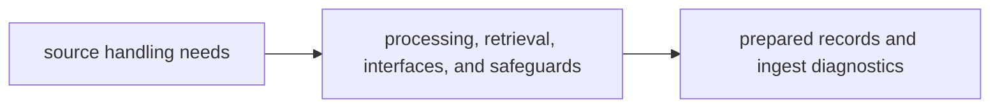

# Capability Map

The capability map for `bijux-canon-ingest` should let a reviewer connect a package promise to the code that carries it. If a capability cannot be tied to a stable module area, it is not owned clearly enough yet.

## Capability Flow

This page should make ingest capability look like a traceable chain from messy
source handling to explicit handoff output. If the reviewer cannot point from
promise to module to output, the package seam is weaker than it sounds.

## Capability To Code

- `processing/` owns cleaning, normalization, and chunking before retrieval begins
- `retrieval/` owns ingest-side record shaping and handoff-ready assembly
- `interfaces/` and `safeguards/` own the package surfaces that make ingest behavior repeatable and defensible

## Visible Outputs

- normalized source material
- chunk collections and retrieval-ready records
- ingest diagnostics that explain how preparation behaved

## Design Pressure

Capabilities stop being trustworthy when they exist mostly in prose and only
loosely in module boundaries. Ingest has to keep preparation promises tied to
named code areas and visible outputs.
