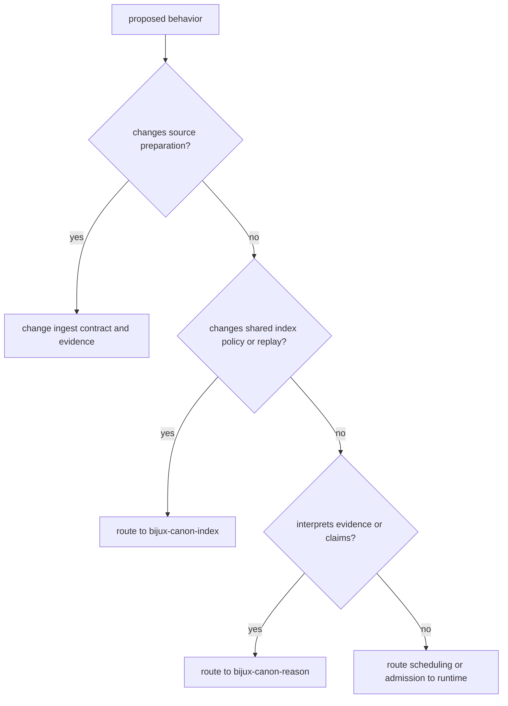

# Change Principles

An ingest change is acceptable when it makes source preparation more explicit
without silently changing identity, offsets, ordering, failure visibility, or
the meaning of persisted artifacts. Convenience is not sufficient if a
downstream consumer can no longer explain how prepared material was produced.

## Invariants To Preserve

| Invariant | Why it matters |
| --- | --- |
| source identity precedes transformation | normalization must not invent a different document owner |
| chunk identity binds source, span, and content | citations and deduplication depend on addressable preparation output |
| ordering and partial failure remain visible | streaming success must not conceal loss or reordering |
| embedding identity qualifies every vector | dimension alone cannot identify model semantics |
| codecs reject unknown contracts | readable bytes are not automatically valid package artifacts |
| local retrieval remains a bounded seam | governed vector execution belongs to index |
| evidence interpretation stays downstream | ingest prepares support; reason evaluates claims |

## Route The Change

A feature may cross packages, but each decision remains with its owner. For
example, ingest may emit a richer chunk fingerprint while index changes how it
records that identity and reason changes how citations refer to it. One package
must not reimplement the others to make the integration appear local.

## Change Evidence

| Changed surface | Evidence required before the new claim is credible |
| --- | --- |
| cleaning or parsing | accepted/rejected input cases, normalization examples, and cache impact |
| chunking or deduplication | span, identity, ordering, tail-policy, and round-trip tests |
| streams or effects | backpressure, scheduling, termination, resource, and partial-failure tests |
| embedding adapter | model specification, dimension, fingerprint, and deterministic baseline tests |
| persistence format | versioned codec tests, loading failure cases, and migration posture |
| CLI or HTTP model | interface mapping, schema drift, exit/error semantics, and end-to-end handoff |
| retrieval-quality claim | named corpus, queries, relevance judgments, parameters, and offline metrics |

Update public examples and artifact descriptions in the same change when an
observable contract moves. A passing unit test does not excuse documentation
that still describes the old identity, offset, or persistence semantics.

## Refusal Conditions

Do not merge a change that turns an expected partial failure into empty
success, weakens an artifact version check, makes model identity optional for a
reproducibility claim, or expands local retrieval into shared indexing policy.
Resolve the owning boundary first.

Use [domain language](domain-language.md) for precise terms and
[test strategy](../quality/test-strategy.md) for the package evidence layers.
