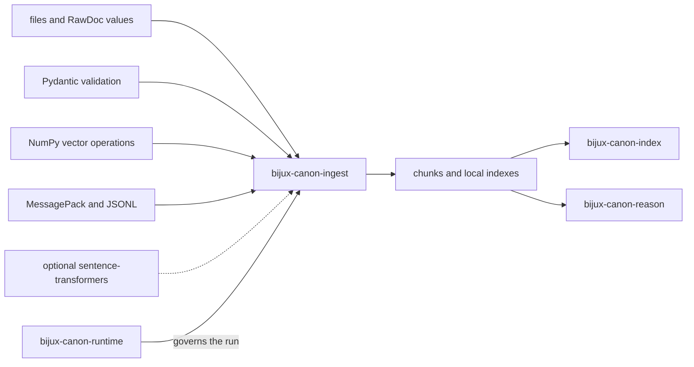

# Dependencies and Adjacencies

`bijux-canon-ingest` owns deterministic source preparation and an intentionally
compact local retrieval path. Its dependencies supply validation, arrays,
serialization, and adapters; none of them move claim formation, orchestration,
or run authority into ingest.

## Dependency shape

Solid arrows represent data or code dependencies. The runtime edge represents
authority over an execution, not ownership of ingest transformations.

## Library dependencies

| Dependency family | Role in ingest | Boundary that remains explicit |
| --- | --- | --- |
| Pydantic and configuration helpers | Validate interface models and configuration | Core document values and transformation semantics remain package-owned |
| NumPy | Implements local cosine-vector operations | Array behavior does not define a governed vector-execution contract |
| MessagePack and JSONL codecs | Encode local indexes and prepared chunks | Consumers load through package codecs and verify schema and fingerprints |
| FastAPI and Uvicorn | Expose the optional v1 HTTP adapter | Authentication, tenancy, quotas, and durable service state remain host responsibilities |
| sentence-transformers, when installed | Supplies a semantic embedding adapter | Model identity, version, dimension, normalization, and cache provenance must accompany the artifact |

The deterministic `hash16` embedder is suitable for contracts, examples, and
tests. It is not a semantic embedding model and must not be presented as one.

## Canonical package adjacencies

### Index

Ingest can emit prepared chunks and build package-local BM25 or NumPy-cosine
indexes. `bijux-canon-index` begins when retrieval needs declared intent,
backend capabilities, budgets, immutable execution artifacts, witnesses, and
replay. Passing ingest output into index does not grant index permission to
reinterpret source identifiers, offsets, or embedding specifications.

### Reason

Reason consumes evidence-bearing records. It owns the transition from evidence
to claims, support references, verification, and reasoning run artifacts.
Ingest citations identify source spans used by local answer assembly; they do
not certify a proposition.

### Agent and runtime

Agent may coordinate ingest as one workflow activity. Runtime may govern the
complete execution and decide whether its evidence is acceptable. Neither
package owns cleaning rules, chunk geometry, or ingest-local ranking behavior.

## Handoff contract

A dependable handoff retains:

- stable document and chunk identity;
- normalized-text offsets and parent-source metadata;
- resolved cleaning, chunking, and filtering configuration;
- embedding model, dimension, metric, and normalization posture;
- index schema, backend, and corpus fingerprint when a local index is used;
- ordered candidates, scores, filters, citations, and structured failures.

Raw provider clients, process-local HTTP index identifiers, and logs are not
portable handoff contracts. See [data contracts](../interfaces/data-contracts.md)
and [integration seams](../architecture/integration-seams.md) for the concrete
values and adapters at these boundaries.
