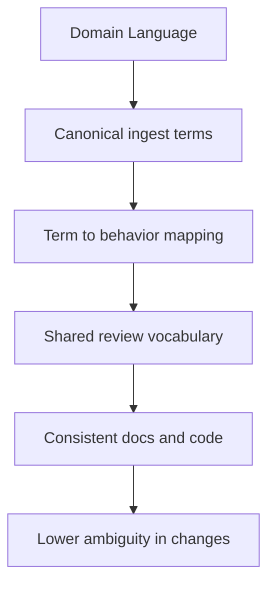

# Domain Language

The language around `bijux-canon-ingest` should reinforce the real package
boundary. Good names shorten review. Weak names force people to keep asking
whether they are looking at local behavior or at something owned elsewhere.

This page keeps the package vocabulary stable enough that docs, code, commit
messages, and review conversations can describe the same idea without drift.

Treat the foundation pages for `bijux-canon-ingest` as the package's durable self-description. If the package still feels blurry after this section, the boundary story is not clear enough yet.

## Visual Summary

## Package Vocabulary Anchors

- package name: `bijux-canon-ingest`
- Python import root: `bijux_canon_ingest`
- owning package directory: `packages/bijux-canon-ingest`
- key outputs: normalized document trees, chunk collections and retrieval-ready records, diagnostic output produced during ingest workflows

## Concrete Anchors

- `packages/bijux-canon-ingest` as the package root
- `packages/bijux-canon-ingest/src/bijux_canon_ingest` as the import boundary
- `packages/bijux-canon-ingest/tests` as the package proof surface

## Use This Page When

- you need the package idea before the implementation detail
- you are deciding whether work belongs here or in a neighboring package
- you want the shortest honest explanation of what this package is for

## Decision Rule

Use `Domain Language` to decide whether a change makes `bijux-canon-ingest` easier or harder to defend as one distinct role in the overall system. If the work makes the package broader without making its role clearer, stop and re-check the boundary before treating the change as a local improvement.

## What This Page Answers

- what problem `bijux-canon-ingest` is supposed to own on purpose
- where the package boundary stops, even when nearby code looks tempting
- which neighboring package seams deserve comparison before the boundary is changed

## Reviewer Lens

- compare the stated boundary with the modules, artifacts, and tests that are supposed to uphold it
- check that out-of-scope behavior is not quietly re-entering through convenience paths
- confirm that the package story still matches the real repository layout and neighboring package docs

## Honesty Boundary

This page can explain the intended boundary of `bijux-canon-ingest`, but it cannot prove that boundary by itself. The real proof still lives in the code, tests, and neighboring package seams that either support or contradict the story told here.

## Next Checks

- move to architecture when the question becomes structural rather than boundary-oriented
- move to interfaces when the question becomes contract-facing
- move to quality when the question becomes proof or review sufficiency

## Purpose

This page records the naming anchors that should stay stable in docs, code, and review discussions.

## Stability

Keep it aligned with the package's real import names, directories, and artifact nouns.
