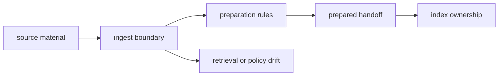

# Foundation

Open this section when the hard question is why `bijux-canon-ingest` owns the work before retrieval begins. These pages should settle whether a proposed change makes prepared source material more predictable or merely pushes another package problem upstream.

## Boundary Model

The foundation story for ingest is only credible if a reader can see where
messy source material stops being tolerated and where downstream search
ownership begins. This section should make that boundary legible before anyone
starts arguing about modules or commands.

## Read These First

- open [Ownership Boundary](https://bijux.io/bijux-canon/02-bijux-canon-ingest/foundation/ownership-boundary/) first when a change could belong in index, reason, agent, or runtime instead
- open [Package Overview](https://bijux.io/bijux-canon/02-bijux-canon-ingest/foundation/package-overview/) when you need the shortest stable description of the package role
- open [Lifecycle Overview](https://bijux.io/bijux-canon/02-bijux-canon-ingest/foundation/lifecycle-overview/) when the question is how raw source material becomes prepared handoff output

## The Mistake This Section Prevents

The most common mistake here is expanding ingest to hide uncertainty that really belongs in retrieval, reasoning, or runtime policy.

## First Proof Check

- `packages/bijux-canon-ingest/src/bijux_canon_ingest/processing` for source preparation ownership
- `packages/bijux-canon-ingest/src/bijux_canon_ingest/retrieval` for the handoff seam into downstream work
- `packages/bijux-canon-ingest/tests` for evidence that the boundary still holds under change

## Pages In This Section

- [Package Overview](https://bijux.io/bijux-canon/02-bijux-canon-ingest/foundation/package-overview/)
- [Scope and Non-Goals](https://bijux.io/bijux-canon/02-bijux-canon-ingest/foundation/scope-and-non-goals/)
- [Ownership Boundary](https://bijux.io/bijux-canon/02-bijux-canon-ingest/foundation/ownership-boundary/)
- [Repository Fit](https://bijux.io/bijux-canon/02-bijux-canon-ingest/foundation/repository-fit/)
- [Capability Map](https://bijux.io/bijux-canon/02-bijux-canon-ingest/foundation/capability-map/)
- [Domain Language](https://bijux.io/bijux-canon/02-bijux-canon-ingest/foundation/domain-language/)
- [Lifecycle Overview](https://bijux.io/bijux-canon/02-bijux-canon-ingest/foundation/lifecycle-overview/)
- [Dependencies and Adjacencies](https://bijux.io/bijux-canon/02-bijux-canon-ingest/foundation/dependencies-and-adjacencies/)
- [Change Principles](https://bijux.io/bijux-canon/02-bijux-canon-ingest/foundation/change-principles/)

## Leave This Section When

- leave this section for [Interfaces](https://bijux.io/bijux-canon/02-bijux-canon-ingest/interfaces/) when the dispute is already about a CLI, schema, artifact, or import surface
- leave this section for [Operations](https://bijux.io/bijux-canon/02-bijux-canon-ingest/operations/) when the real problem is setup, diagnostics, release, or recovery
- leave this section for [Quality](https://bijux.io/bijux-canon/02-bijux-canon-ingest/quality/) when the boundary is already understood and the open question is proof

## Design Pressure

If a page here starts defending retrieval quality or later workflow policy, the
package boundary is already slipping. Ingest stays coherent by making input
predictable, then handing the work forward.
