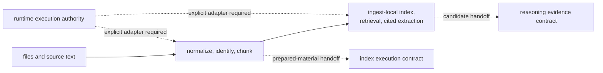

# Foundation

`bijux-canon-ingest` turns source material into deterministic records that can
be inspected, persisted, retrieved, and cited. Its authority begins with input
normalization and ends at the retrieval-ready handoff. It does not decide what
a claim means, whether a conclusion is justified, or how a multi-package run is
scheduled.

## Package boundary

```mermaid
flowchart LR
    source["files and source text"]
    prepare["normalize, identify, chunk"]
    local["ingest-local index,<br/>retrieval, cited extraction"]
    index["index execution contract"]
    reason["reasoning evidence contract"]
    runtime["runtime execution authority"]

    source --> prepare --> local
    prepare -. prepared-material handoff .-> index
    local -. candidate handoff .-> reason
    runtime -. explicit adapter required .-> prepare
    runtime -. explicit adapter required .-> local
```

The package deliberately contains a complete local path from documents to
ranked chunks and extractive answers. That path is useful for compact
applications and reproducible examples. Repository-wide index ownership still
belongs to `bijux-canon-index`; evidence interpretation belongs to
`bijux-canon-reason`; role orchestration belongs to `bijux-canon-agent`; and
whole-run acceptance, persistence, and replay belong to
`bijux-canon-runtime`.

The dashed runtime links describe an ownership seam, not a working package-root
adapter. Runtime currently requests a `retrieve` callable with runtime-shaped
scope and vector-contract arguments; ingest's implemented retrieval is
path-based and is not exported from the package root. An integration must map
those contracts while retaining preparation and index identity.

## The preparation decision

Ingest answers one durable question: **which retrieval-ready records were
derived from these sources under these exact rules?** A reviewable answer needs
all of the following:

| Part | Minimum retained identity |
| --- | --- |
| source | stable document or byte-set identity plus disposition |
| rules | effective cleaning, safeguard, chunk and optional embedding configuration |
| transformation | normalized record, typed failures and stage observations |
| segmentation | prepared parent, ordered chunk identity, offsets and geometry |
| persistence | output/index format, digest, location and package version |
| handoff | receiving boundary plus the exact records and failures transferred |

Retrieval may add ranking and citation observations to that decision. It does
not retroactively establish the truth, completeness, or authority of the
source material.

## What the package owns

| Responsibility | Contract | Primary guide |
| --- | --- | --- |
| Source preparation | stable document identity, normalized text, and typed records | [Package overview](package-overview.md) |
| Segmentation | deterministic chunks with source identity and normalized-text offsets | [Lifecycle overview](lifecycle-overview.md) |
| Local retrieval | persisted BM25 or NumPy cosine indexes and ranked candidates | [Capability map](capability-map.md) |
| Extractive answers | answers whose citations resolve to retrieved chunks | [Ownership boundary](ownership-boundary.md) |
| Resilient execution primitives | results, options, streams, retry, breaker, resource, and rule controls | [Dependencies and adjacencies](dependencies-and-adjacencies.md) |

## Boundary decisions

Use these distinctions before extending the package:

- A transformation belongs here when it makes the same source become the same
  prepared representation under the same configuration.
- A retrieval implementation belongs here when it is the package's local,
  persistence-backed document path. Shared indexing policy and cross-package
  index services belong in `bijux-canon-index`.
- A scoring or verification rule does not belong here when it interprets the
  evidentiary meaning of a result; that is reasoning authority.
- Scheduling, tenancy, authentication, and durable service lifecycle are
  deployment concerns, not implicit ingest guarantees.

## Important limits

- Chunk offsets refer to normalized Python strings, not byte positions in the
  original file.
- The hash embedding is a deterministic baseline, not a semantic model.
- The default HTTP index store is process-local and does not provide tenancy,
  authentication, or durable service storage.
- The lightweight lazy pipeline and the document pipeline do not promise
  identical transformation steps; structural deduplication is a documented
  distinction.

## Read by question

| Question | Guide |
| --- | --- |
| Why does ingest exist? | [Package overview](package-overview.md) |
| What is intentionally outside its authority? | [Scope and non-goals](scope-and-non-goals.md) |
| Where does ownership pass to another package? | [Ownership boundary](ownership-boundary.md) |
| How does it fit into the monorepo? | [Repository fit](repository-fit.md) |
| Which terms have precise meanings? | [Domain language](domain-language.md) |
| Which changes preserve the contract? | [Change principles](change-principles.md) |
