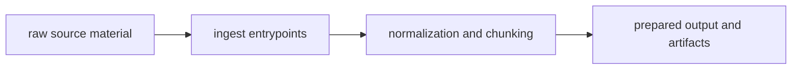

# Lifecycle Overview

The ingest lifecycle starts with raw source material and ends when prepared output is stable enough for search to trust. It should not continue into retrieval interpretation or claim production.

## Lifecycle Flow

This page should make ingest feel like a bounded preparation story. The
lifecycle matters because it shows where messy source handling stops and where
the next package can start from stable prepared material.

## Lifecycle Shape

- input enters through package interfaces and configuration surfaces
- processing normalizes and chunks the material into predictable internal forms
- retrieval-side assembly shapes the output into handoff records and artifacts

## Handoff Point

The lifecycle stops at prepared output. `bijux-canon-index` owns what happens when that output becomes searchable behavior.

## Design Pressure

If the ingest lifecycle starts explaining retrieval behavior or downstream
interpretation, the package is carrying work that belongs somewhere else. The
handoff has to stay explicit enough that search can trust it without inheriting
source cleanup logic.
