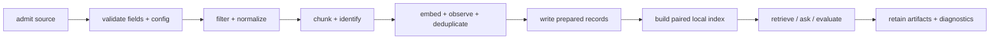

# Lifecycle Overview

Ingest has two connected lifecycles: document preparation and local retrieval.
Both retain the identities and configuration needed to explain their outputs.

```mermaid
flowchart LR
    admit["admit source"]
    validate["validate fields + config"]
    clean["filter + normalize"]
    chunk["chunk + identify"]
    enrich["embed + observe + deduplicate"]
    write["write prepared records"]
    index["build paired local index"]
    query["retrieve / ask / evaluate"]
    retain["retain artifacts + diagnostics"]

    admit --> validate --> clean --> chunk --> enrich --> write
    write --> index --> query --> retain
```

## Preparation lifecycle

1. **Admit source.** A reader translates file or row input into a typed raw
   document or an explicit expected failure.
2. **Resolve configuration.** Chunk size, overlap, tail behavior, filters,
   cleaner, embedding specification, observations, and output settings become
   the effective run contract.
3. **Normalize.** Filtering preserves or rejects the raw record; cleaning
   produces a new immutable document.
4. **Segment.** Chunking creates ordered normalized-string spans and derives
   chunk identity from document ID, offsets, and text.
5. **Enrich.** The selected embedder adds vectors. The document pipeline can
   materialize observations and apply stable structural deduplication.
6. **Publish.** Prepared values are serialized to the selected CSV or JSONL
   boundary with diagnostics and configuration evidence.

## Local retrieval lifecycle

1. Build a BM25 or NumPy cosine index from the prepared chunk set.
2. Persist index metadata and chunk records as one logical artifact.
3. Load the paired artifact and rank candidates under its metric and embedding
   configuration.
4. Produce an extractive answer whose citation IDs resolve to the retrieved
   chunks, or execute the declared evaluation cases.
5. Retain the query, artifact identity, ordered results, citations, metrics,
   and diagnostic evidence needed for review.

## Alternative entrypoints

The command line dispatches ordinary document-pipeline arguments separately
from `index`, `retrieve`, `ask`, and `eval`. HTTP v1 exposes health, chunk,
index build, retrieve, and ask through a process-scoped application. Python
callers may compose lower-level records, streams, results, safeguards, and
adapters directly.

These entrypoints share concepts, not hidden global state. The default HTTP
index store is process-local. File-based CLI retrieval persists its paired
local artifacts. A new process therefore has different lifecycle semantics
unless the application supplies an explicit store.

## Completion criteria

Preparation is complete when every emitted record is valid, identified, and
serializable under the effective configuration. Local retrieval is complete
when the index and chunk set agree and every returned citation resolves.
Neither completion establishes source authority, semantic model quality, or
downstream claim truth.
