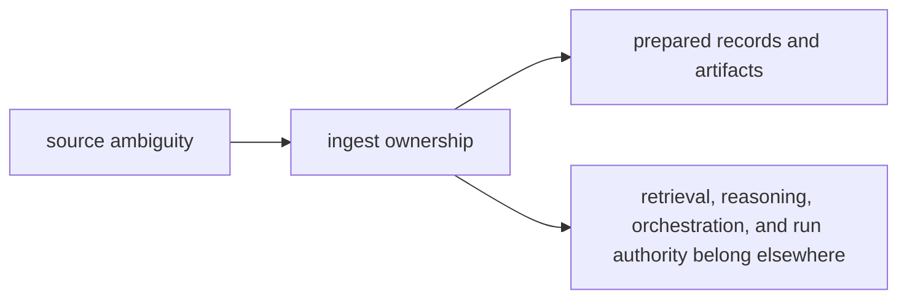

# Ownership Boundary

`bijux-canon-ingest` owns the part of the system that makes source material predictable before retrieval begins. Use it when a change looks plausible here and somewhere else at the same time.

## Boundary Map

This page should make one decision easier: is the problem still about making
source material stable, or has it already become someone else's behavior? The
boundary works only when the handoff to the next package stays visible.

## Use This Boundary Test

- keep the work here when it removes ambiguity from source material before any search or reasoning step starts
- move the work to `bijux-canon-index` when it changes retrieval execution, vector behavior, or replay semantics
- move the work upward when it changes claim meaning, workflow coordination, or run acceptance policy

## Borderline Example

A parser tweak that stabilizes chunk boundaries belongs here. A tweak that changes retrieval ranking because chunk shape happened to expose the problem does not.

## First Proof Check

- `packages/bijux-canon-ingest/src` for the owned implementation boundary
- `packages/bijux-canon-ingest/tests` for proof that the boundary survives change
- neighboring handbook roots in index, reason, agent, and runtime when the work still looks plausible elsewhere

## Design Pressure

The pressure on ingest is to solve source instability without turning into a
hidden home for retrieval or reasoning fixes. If a change only makes sense once
search or claim behavior enters the story, the boundary has already moved.
