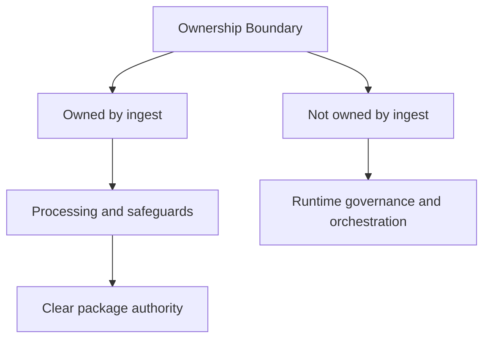

# Ownership Boundary

Ownership in `bijux-canon-ingest` should be visible in checked-in structure, not
only in prose. The source tree shows where the package expects work to live, and
the tests show whether that expectation is protected when the code changes.

Use this page when a change proposal feels plausible in more than one package
and someone needs a concrete reason to keep the work here or move it elsewhere.

Treat the foundation pages for `bijux-canon-ingest` as the package's durable self-description. If the package still feels blurry after this section, the boundary story is not clear enough yet.

## Visual Summary

## Owned Code Areas

- `src/bijux_canon_ingest/processing` for deterministic document transforms
- `src/bijux_canon_ingest/retrieval` for retrieval-oriented models and assembly
- `src/bijux_canon_ingest/application` for package workflows
- `src/bijux_canon_ingest/infra` for local adapters and infrastructure helpers
- `src/bijux_canon_ingest/interfaces` for CLI and HTTP boundaries
- `src/bijux_canon_ingest/safeguards` for protective rules for ingest behavior

## Adjacent Systems

- feeds prepared material toward bijux-canon-index and bijux-canon-reason
- stays under runtime governance instead of defining replay authority itself

## Concrete Anchors

- `packages/bijux-canon-ingest` as the package root
- `packages/bijux-canon-ingest/src/bijux_canon_ingest` as the import boundary
- `packages/bijux-canon-ingest/tests` as the package proof surface

## Use This Page When

- you need the package idea before the implementation detail
- you are deciding whether work belongs here or in a neighboring package
- you want the shortest honest explanation of what this package is for

## Decision Rule

Use `Ownership Boundary` to decide whether a change makes `bijux-canon-ingest` easier or harder to defend as one distinct role in the overall system. If the work makes the package broader without making its role clearer, stop and re-check the boundary before treating the change as a local improvement.

## What This Page Answers

- what problem `bijux-canon-ingest` is supposed to own on purpose
- where the package boundary stops, even when nearby code looks tempting
- which neighboring package seams deserve comparison before the boundary is changed

## Reviewer Lens

- compare the stated boundary with the modules, artifacts, and tests that are supposed to uphold it
- check that out-of-scope behavior is not quietly re-entering through convenience paths
- confirm that the package story still matches the real repository layout and neighboring package docs

## Honesty Boundary

This page can explain the intended boundary of `bijux-canon-ingest`, but it cannot prove that boundary by itself. The real proof still lives in the code, tests, and neighboring package seams that either support or contradict the story told here.

## Next Checks

- move to architecture when the question becomes structural rather than boundary-oriented
- move to interfaces when the question becomes contract-facing
- move to quality when the question becomes proof or review sufficiency

## Purpose

This page ties package ownership to concrete directories instead of abstract slogans.

## Stability

Keep it aligned with the current module layout.
