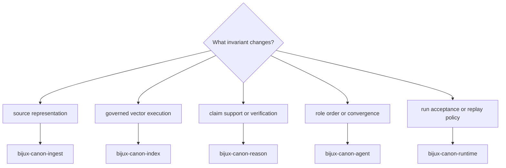
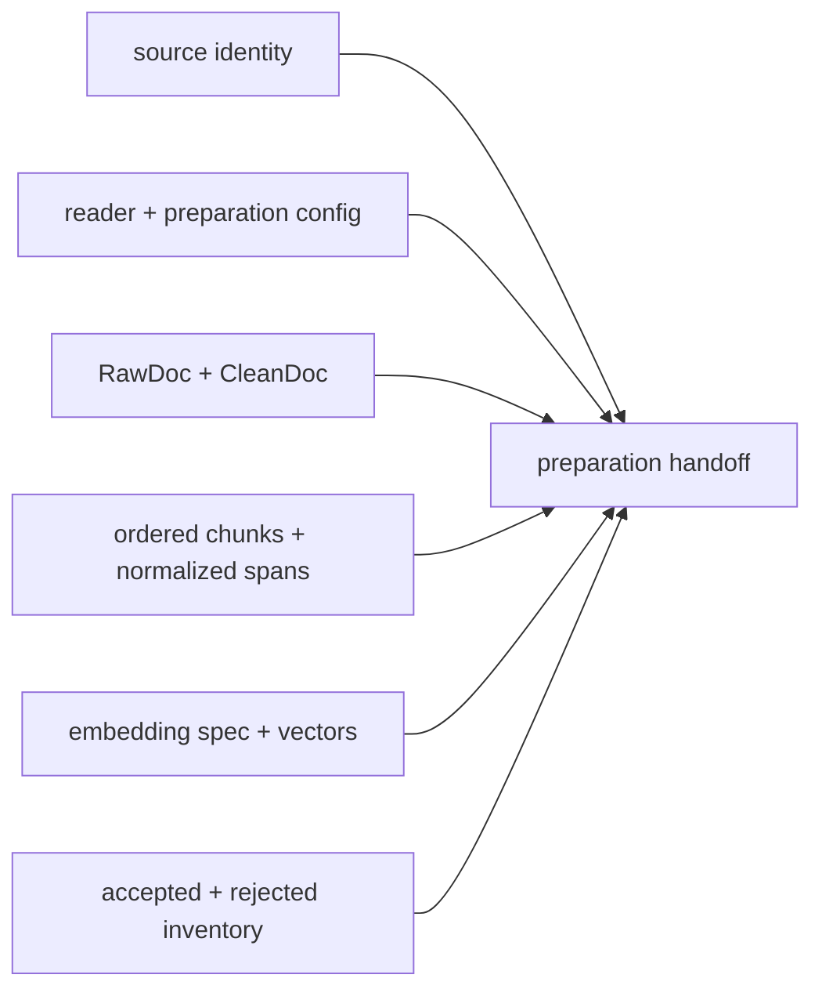
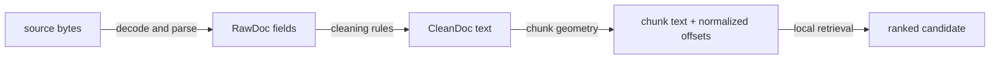

# Ownership Boundary

Ingest authority is transformation authority. It decides how source material
becomes immutable documents, chunks, local indexes, ranked candidates, and
extractive citations under declared configuration.

```mermaid
flowchart TD
    change{"What invariant changes?"}
    representation["source representation"]
    vector["governed vector execution"]
    meaning["claim support or verification"]
    orchestration["role order or convergence"]
    authority["run acceptance or replay policy"]

    change --> representation
    change --> vector
    change --> meaning
    change --> orchestration
    change --> authority

    representation --> ingest["bijux-canon-ingest"]
    vector --> index["bijux-canon-index"]
    meaning --> reason["bijux-canon-reason"]
    orchestration --> agent["bijux-canon-agent"]
    authority --> runtime["bijux-canon-runtime"]
```

## Decision table

| Change | Owner | Reason |
| --- | --- | --- |
| normalize whitespace before chunk identity is computed | ingest | changes the prepared representation |
| alter overlap, tail handling, or structural deduplication | ingest | changes chunk boundaries, order, or identity |
| add a local lexical scoring option for the compact retrieval path | ingest | extends the package-owned reference workflow |
| select an eligible backend under exact/ANN and replay contracts | index | governs vector execution across backend capabilities |
| decide that cited bytes support a derived statement | reason | changes claim grounding and verification |
| retry a role because workflow convergence has not been reached | agent | changes orchestration lifecycle |
| permit or reject a completed flow under tenant policy | runtime | changes final run authority |

## The local retrieval seam

Both ingest and index contain retrieval-related code, but their authority is
different:

- ingest owns a local document workflow that makes preparation testable and
  provides BM25/NumPy reference retrieval and cited extraction;
- index owns explicit execution intent, artifact materialization, backend
  capability negotiation, exact or bounded ANN execution, and replay evidence.

Moving from the first to the second is not triggered by corpus size alone. The
boundary is crossed when retrieval needs governed backend choice, execution
contracts, cross-run identity, or replay semantics.

## Handoff contract

Downstream consumers receive stable source and chunk identity, normalized
text, offsets within that text, embeddings when configured, metadata, and
explicit result or failure values. They must not reinterpret normalized
offsets as original byte offsets or assume hash embeddings carry semantic
meaning.

The owner of a defect is the layer whose invariant was false. A changed chunk
caused by normalization belongs here; a correct chunk ranked incorrectly under
a declared vector contract belongs in index.

## Minimum preparation handoff

A downstream package should receive one custody packet rather than unrelated
text and vectors:

| Handoff field | Why it is required |
| --- | --- |
| source identity and retained digest/reference | identifies the admitted input without claiming source reliability |
| reader/parser and effective preparation configuration | explains how bytes or rows became fields and normalized text |
| `RawDoc` and `CleanDoc` relationship | separates parsed representation from normalized representation |
| ordered chunk identities, text, parent links and normalized offsets | makes segmentation and citation geometry auditable |
| embedding specification and vector identity, when present | prevents vectors from being detached from model, dimension and metric assumptions |
| admitted, rejected and partial-status inventory | prevents downstream success from hiding missing source material |
| observations, safeguards and typed failures | exposes quality signals and effect-boundary behavior |
| serialization/index format and artifact fingerprint | makes persisted material loadable or explicitly incompatible |

```mermaid
flowchart LR
    source["source identity"]
    config["reader + preparation config"]
    prepared["RawDoc + CleanDoc"]
    chunks["ordered chunks + normalized spans"]
    optional["embedding spec + vectors"]
    disposition["accepted + rejected inventory"]
    packet["preparation handoff"]

    source --> packet
    config --> packet
    prepared --> packet
    chunks --> packet
    optional --> packet
    disposition --> packet
```

If a field is unavailable, the handoff must narrow its claim. For example,
chunks without a source-to-normalized map may support normalized-text
citations, but not original-byte coordinates.

## Resolve boundary disputes by the first false record

| Observed problem | Inspect first | Likely owner |
| --- | --- | --- |
| source row was decoded into the wrong field | reader output and `RawDoc` | ingest |
| normalized text or chunk offsets differ under the same configuration | `CleanDoc`, rules and chunk geometry | ingest |
| vector dimension/specification in the handoff is wrong | embedding output and `EmbeddingSpec` | ingest or its selected embedder boundary |
| immutable prepared vectors are ranked differently by a declared backend | execution request, backend and result | index |
| top-ranked bytes do not support the proposed statement | evidence span, support edge and findings | reason |
| correct preparation output is omitted from a workflow merge | shard/merge lineage and agent trace | agent |
| prepared artifact is valid but disallowed for the tenant or flow | manifest, policy and runtime verdict | runtime |

Begin at the earliest record whose invariant is false. Later packages retain
the failure and its identity; they do not become the owner merely because they
detected it.

## Coordinate Spaces Are Part Of Custody

Cleaning can change case, whitespace, or retained content before chunking.
Chunk `start` and `end` therefore address the normalized `CleanDoc` text, not
the original CSV bytes or characters.

```mermaid
flowchart LR
    bytes["source bytes"]
    parsed["RawDoc fields"]
    normalized["CleanDoc text"]
    chunk["chunk text + normalized offsets"]
    candidate["ranked candidate"]

    bytes -->|decode and parse| parsed
    parsed -->|cleaning rules| normalized
    normalized -->|chunk geometry| chunk
    chunk -->|local retrieval| candidate
```

| Question | Evidence required |
| --- | --- |
| which source entered the pipeline? | source identifier plus retained input identity or digest |
| which text was segmented? | normalized parent text and effective cleaning configuration |
| where did a chunk come from? | parent identity, normalized offsets, chunk text, and geometry |
| can a citation be mapped to original bytes? | an explicit source-to-normalized mapping produced during preparation |

The current chunk contract does not carry a general source-byte mapping. A
consumer may quote the normalized span and identify its parent, but must not
claim original-byte coordinates unless it retained an independent mapping.
