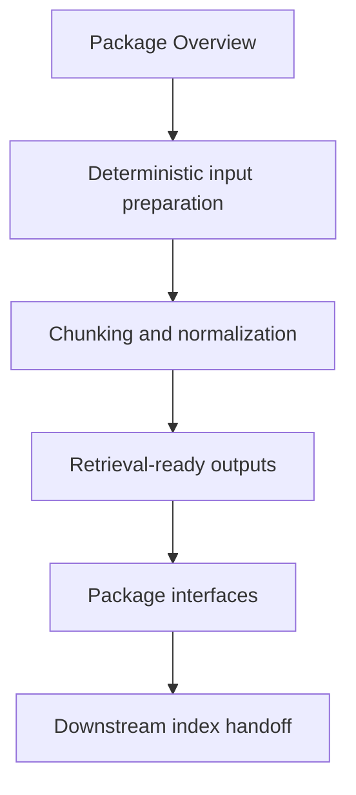

# Package Overview

`bijux-canon-ingest` exists so one durable part of the system can stay legible.
Its job is to own deterministic document ingestion, chunking, retrieval assembly, and ingest-facing boundaries.

If a reader cannot explain this package in one or two sentences after skimming
this page, the package boundary is still too fuzzy and later pages will inherit
that confusion.

Treat the foundation pages for `bijux-canon-ingest` as the package's durable self-description. If the package still feels blurry after this section, the boundary story is not clear enough yet.

## Visual Summary

## What It Owns

- document cleaning, normalization, and chunking
- ingest-local retrieval and indexing assembly
- package-local CLI and HTTP boundaries
- ingest-specific safeguards, adapters, and observability helpers

## What It Does Not Own

- runtime-wide replay authority and persistence
- cross-package vector execution semantics
- repository maintenance automation

## Concrete Anchors

- `packages/bijux-canon-ingest` as the package root
- `packages/bijux-canon-ingest/src/bijux_canon_ingest` as the import boundary
- `packages/bijux-canon-ingest/tests` as the package proof surface

## Use This Page When

- you need the package idea before the implementation detail
- you are deciding whether work belongs here or in a neighboring package
- you want the shortest honest explanation of what this package is for

## Decision Rule

Use `Package Overview` to decide whether a change makes `bijux-canon-ingest` easier or harder to defend as one distinct role in the overall system. If the work makes the package broader without making its role clearer, stop and re-check the boundary before treating the change as a local improvement.

## What This Page Answers

- what problem `bijux-canon-ingest` is supposed to own on purpose
- where the package boundary stops, even when nearby code looks tempting
- which neighboring package seams deserve comparison before the boundary is changed

## Reviewer Lens

- compare the stated boundary with the modules, artifacts, and tests that are supposed to uphold it
- check that out-of-scope behavior is not quietly re-entering through convenience paths
- confirm that the package story still matches the real repository layout and neighboring package docs

## Honesty Boundary

This page can explain the intended boundary of `bijux-canon-ingest`, but it cannot prove that boundary by itself. The real proof still lives in the code, tests, and neighboring package seams that either support or contradict the story told here.

## Next Checks

- move to architecture when the question becomes structural rather than boundary-oriented
- move to interfaces when the question becomes contract-facing
- move to quality when the question becomes proof or review sufficiency

## Purpose

This page gives the shortest honest description of what the package is for.

## Stability

Keep it aligned with the real package boundary described by the code and tests.
