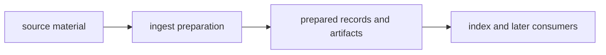

# Package Overview

`bijux-canon-ingest` exists to make source material predictable before retrieval begins. Its job is not to guess what downstream packages will want. Its job is to remove source ambiguity so later packages can work from stable prepared input.

## Role Model

This page should make ingest feel like one narrow promise: turn messy source
material into stable prepared input without smuggling retrieval or reasoning
policy into the handoff.

## Boundary Verdict

If the work improves cleaning, normalization, chunking, or ingest-side record shaping before search starts, it belongs here. If it starts deciding retrieval quality, claim meaning, or run acceptance, it has crossed the boundary.

## What This Package Makes Possible

- prepared source material becomes deterministic enough for indexing and reasoning to reuse without reinterpretation
- ingest artifacts and records stay stable enough to act as a trustworthy handoff seam
- source cleanup stays local instead of leaking into every later package

## Tempting Mistakes

- pulling retrieval ranking or vector behavior into ingest because it feels close to chunk preparation
- hiding reasoning-time fixes inside document shaping so later packages appear simpler than they are
- expanding ingest with workflow or authority logic that belongs to agent or runtime

## First Proof Check

- `packages/bijux-canon-ingest/src/bijux_canon_ingest/processing` for preparation ownership
- `packages/bijux-canon-ingest/src/bijux_canon_ingest/retrieval` for handoff-ready assembly
- `packages/bijux-canon-ingest/tests` for proof that prepared output stays stable

## Design Pressure

The pressure on ingest is to solve source instability without becoming the
place where later-package ambiguity gets hidden. If the package starts making
downstream decisions implicitly, the handoff stops being trustworthy.
