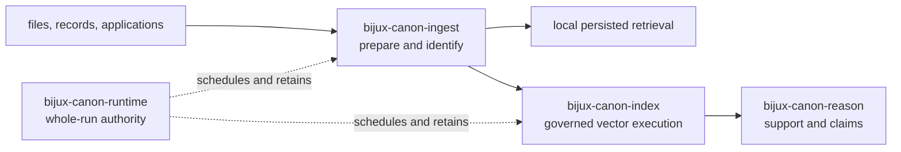
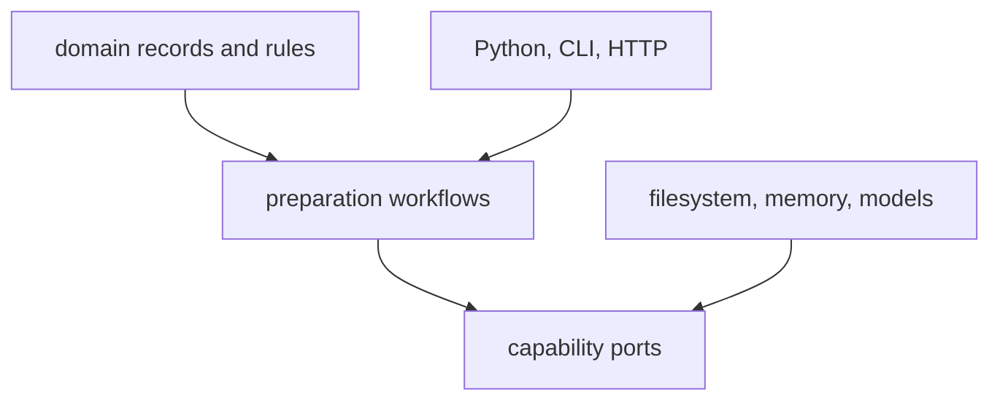

# Repository Fit

`bijux-canon-ingest` is independently installable because prepared material is
a durable system boundary. Applications can use its typed Python facade, CLI,
or HTTP contract without adopting the complete Bijux Canon runtime, and other
packages can consume its outputs without inheriting its transformation logic.

## Position In The Package Family

The local retrieval path makes ingest useful in compact deployments and
examples. It does not transfer ownership of capability resolution, ANN policy,
or vector replay from index. Likewise, extractive citation assembly does not
transfer claim verification from reason.

## Independent Package Contract

| Surface | What independence provides |
| --- | --- |
| distribution | consumers can install preparation behavior without the composed runtime |
| Python facade | typed records, results, pipelines, and retrieval primitives have one owner |
| console command | file and pipeline workflows can run without an application wrapper |
| HTTP contract | preparation can sit behind a process boundary with explicit request and error shapes |
| persisted artifacts | chunks and local index state can be handed off and inspected |
| package tests | transformation, streaming, serialization, and quality claims can evolve locally |

Independence does not mean isolation from shared standards. The repository
coordinates versioning, API publication, documentation, CI, and release
membership while the package owns preparation semantics.

## Dependency Direction

Ingest may define ports for embedders, storage, clocks, and logging. Concrete
infrastructure implements those ports inward. Product packages must not become
hidden dependencies merely to reuse their application policy. Cross-package
composition belongs in an application or runtime boundary.

## When This Boundary Would Be Wrong

The package boundary would be decorative if its public artifacts had no stable
identity, callers had to import runtime internals to prepare data, or governed
index and reasoning policy accumulated here. Those are signals to restore the
handoff—not reasons to blur more ownership into ingest.

Continue with [ownership boundary](ownership-boundary.md) for neighboring
responsibilities and [repository architecture](../../01-bijux-canon/foundation/package-map.md)
for the complete package family.
