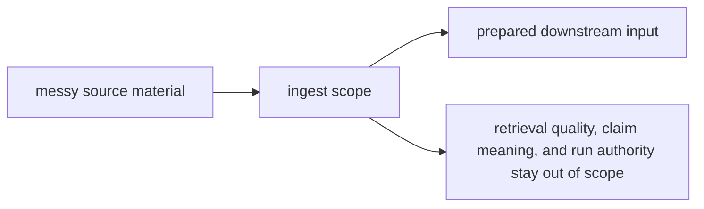

# Scope and Non-Goals

The scope of `bijux-canon-ingest` is narrower than “anything near the front of the pipeline.” It owns preparation work that makes later packages less ambiguous, not work that makes them less inconvenient.

## Scope Map

This page should show ingest as a narrowing step, not as a general prelude to
the whole platform. The scope stays healthy when it produces stable prepared
input and then stops.

## In Scope

- cleaning, normalization, and chunking before search begins
- ingest records and artifacts that become the explicit handoff into downstream packages
- package-local interfaces and safeguards required to run ingest work repeatably

## Non-Goals

- deciding retrieval quality, search replay, or vector-store behavior
- deciding what evidence means once claims and checks are being formed
- deciding whether a run is durable, governed, or acceptable to keep

## Scope Check

If the change makes later packages depend on ingest for anything beyond prepared input, the package is growing past its job.

## Design Pressure

If ingest starts absorbing work because downstream packages would rather not own
their own ambiguity, the package becomes broader without becoming clearer. The
non-goals have to stay explicit enough to resist that pull.
