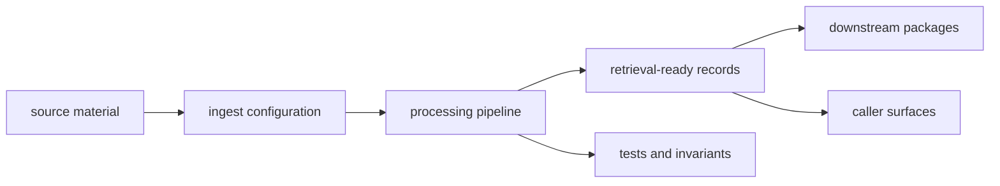

# Ingest Handbook

`bijux-canon-ingest` owns deterministic document preparation, chunking, and retrieval-ready shaping. It is the package that turns raw source material into stable inputs the rest of the system can trust.

The main failure this handbook prevents is treating ingest like a convenient place for every upstream cleanup, retrieval tweak, or workflow shortcut. Ingest should only grow when the change makes prepared source material more predictable, not when another package wants to offload its own complexity.

## What The Reader Should See First

Ingest is the preparation gate. It takes source material that may be noisy,
partial, duplicated, or inconsistently shaped and produces material that later
packages can treat as intentional input. The value is not that ingest does
everything near documents. The value is that it stops uncertainty from leaking
into retrieval, reasoning, and runtime review.

Readers should come away with one clear picture: ingest is where messy source
material stops being tolerated as-is. The package earns its place by making
preparation reproducible enough that every later package can assume the input
was shaped on purpose rather than by accident.

## What This Package Owns

- document cleaning, normalization, and chunking before retrieval
- ingest-side records and artifacts that downstream packages accept as prepared input
- deterministic preparation workflows that remove source ambiguity before indexing

## What This Package Does Not Own

- vector execution, retrieval replay, and backend index behavior
- claim formation, reasoning policy, or multi-step orchestration semantics
- runtime acceptance, persistence, and governed replay authority

## Boundary Test

If the question is still about making source material predictable before any
vector store or reasoning step touches it, it belongs here. If the question
starts with retrieval quality, claim behavior, agent coordination, or run
acceptance, it belongs somewhere else.

## First Proof Check

- `packages/bijux-canon-ingest/src/bijux_canon_ingest/processing` for deterministic preparation logic
- `packages/bijux-canon-ingest/src/bijux_canon_ingest/retrieval` for retrieval-ready records and assembly owned before index handoff
- `packages/bijux-canon-ingest/src/bijux_canon_ingest/interfaces` for CLI, HTTP, serialization, and caller-facing boundaries
- `packages/bijux-canon-ingest/tests` for the proof that prepared output stays stable under change

## Start Here

- open [Foundation](https://bijux.io/bijux-canon/02-bijux-canon-ingest/foundation/) when the question is why this package exists or where its ownership stops
- open [Architecture](https://bijux.io/bijux-canon/02-bijux-canon-ingest/architecture/) when you need module boundaries, dependency flow, or execution shape
- open [Interfaces](https://bijux.io/bijux-canon/02-bijux-canon-ingest/interfaces/) when the question is about commands, APIs, schemas, imports, or artifacts that callers may treat as stable
- open [Operations](https://bijux.io/bijux-canon/02-bijux-canon-ingest/operations/) when you need local workflow, diagnostics, release, or recovery guidance
- open [Quality](https://bijux.io/bijux-canon/02-bijux-canon-ingest/quality/) when the question is whether the package has proved its promises strongly enough

## Pages In This Package

- [Foundation](https://bijux.io/bijux-canon/02-bijux-canon-ingest/foundation/)
- [Architecture](https://bijux.io/bijux-canon/02-bijux-canon-ingest/architecture/)
- [Interfaces](https://bijux.io/bijux-canon/02-bijux-canon-ingest/interfaces/)
- [Operations](https://bijux.io/bijux-canon/02-bijux-canon-ingest/operations/)
- [Quality](https://bijux.io/bijux-canon/02-bijux-canon-ingest/quality/)

## Leave This Handbook When

- the question is now about retrieval execution rather than preparation
- the next stop is a concrete caller contract, workflow, or test surface
- the behavior is really owned by reasoning, orchestration, or runtime
