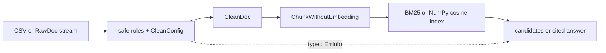

# Ingest Handbook

`bijux-canon-ingest` turns source documents into deterministic records, chunks,
local retrieval indexes, ranked candidates, and extractive answers with
citations. It supports both small in-process transformations and file-backed
pipelines without making HTTP, CLI, or orchestration dependencies mandatory at
package import time.

Ingest owns uncertainty in source shape. Invalid chunk geometry, malformed CSV
rows, unsafe filtering rules, retry exhaustion, and circuit-breaker decisions
remain explicit results rather than becoming silent changes to downstream
evidence.

```mermaid
flowchart LR
    csv["CSV or RawDoc stream"]
    rules["safe rules + CleanConfig"]
    clean["CleanDoc"]
    chunks["ChunkWithoutEmbedding"]
    index["BM25 or NumPy cosine index"]
    result["candidates or cited answer"]

    csv --> rules --> clean --> chunks --> index --> result
    rules -. typed ErrInfo .-> result
```

## Available Surfaces

| Surface | Concrete operations | Stable evidence |
| --- | --- | --- |
| Python root | `RawDoc`, `CleanDoc`, `RagEnv`, `clean_doc`, `chunk_doc`, streaming combinators, `Result`, retry and breaker helpers | `__all__`, API-freeze tests, typed marker |
| command | CSV pipeline; `index build`; `retrieve`; `ask`; `eval` | parser tests and end-to-end fixtures |
| HTTP v1 | health, chunk, index build, retrieve, ask | `apis/bijux-canon-ingest/v1/schema.yaml` |
| storage | CSV document input, JSONL chunk output, persisted BM25 or NumPy-cosine index | adapter and round-trip tests |

The package-local index and extractive-answer features support an ingest-owned
workflow. `bijux-canon-index` remains the owner of declared vector execution,
backend capability negotiation, provenance-rich execution artifacts, and
replay comparison across vector backends.

## What This Package Owns

- document cleaning, normalization, and chunking before retrieval
- ingest-side records and artifacts that downstream packages accept as prepared input
- deterministic preparation workflows that remove source ambiguity before indexing

## What This Package Does Not Own

- vector execution, retrieval replay, and backend index behavior
- claim formation, reasoning policy, or multi-step orchestration semantics
- runtime acceptance, persistence, and governed replay authority

## Ownership Test

If the question is still about making source material predictable before any
vector store or reasoning step touches it, it belongs here. If the question
starts with retrieval quality, claim behavior, agent coordination, or run
acceptance, it belongs somewhere else.

## Implementation Anchors

- `packages/bijux-canon-ingest/src/bijux_canon_ingest/processing` for deterministic preparation logic
- `packages/bijux-canon-ingest/src/bijux_canon_ingest/retrieval` for retrieval-ready records and assembly owned before index handoff
- `packages/bijux-canon-ingest/src/bijux_canon_ingest/interfaces` for CLI, HTTP, serialization, and caller-facing boundaries
- `packages/bijux-canon-ingest/tests` for the proof that prepared output stays stable under change

## Start Here

- open [Foundation](https://bijux.io/bijux-canon/02-bijux-canon-ingest/foundation/) when the question is why this package exists or where its ownership stops
- open [Architecture](https://bijux.io/bijux-canon/02-bijux-canon-ingest/architecture/) when you need module boundaries, dependency flow, or execution shape
- open [Interfaces](https://bijux.io/bijux-canon/02-bijux-canon-ingest/interfaces/) when the question is about commands, APIs, schemas, imports, or artifacts that callers may treat as stable
- open [Operations](https://bijux.io/bijux-canon/02-bijux-canon-ingest/operations/) when you need local workflow, diagnostics, release, or recovery guidance
- open [Quality](https://bijux.io/bijux-canon/02-bijux-canon-ingest/quality/) when the question is whether the package has proved its promises strongly enough

## Reference Areas

- [Foundation](https://bijux.io/bijux-canon/02-bijux-canon-ingest/foundation/)
- [Architecture](https://bijux.io/bijux-canon/02-bijux-canon-ingest/architecture/)
- [Interfaces](https://bijux.io/bijux-canon/02-bijux-canon-ingest/interfaces/)
- [Operations](https://bijux.io/bijux-canon/02-bijux-canon-ingest/operations/)
- [Quality](https://bijux.io/bijux-canon/02-bijux-canon-ingest/quality/)

## Failure Boundaries

- parsing and configuration failures identify the invalid input or override
- transformation failures use typed `ErrInfo` values and retain stage context
- bulk processing can fail fast, collect errors, cap errors, or stop at an
  explicit error-rate threshold
- retries, circuit breakers, resource guards, and caches are separate policies;
  enabling one does not silently imply another
- optional YAML, Typer, NumPy, sentence-transformer, and HTTP integrations are
  loaded at their owning boundary rather than on a dependency-light root import
