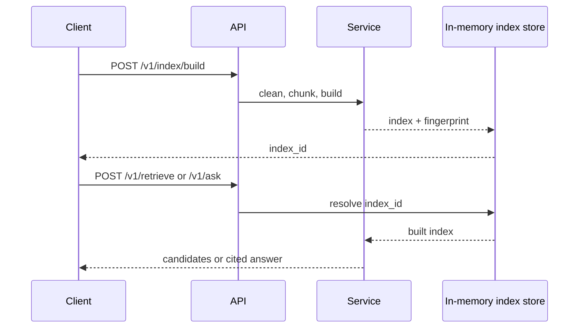

# HTTP API

The ingest HTTP adapter exposes deterministic chunking and a process-local
retrieval workflow. It is a FastAPI application created by `create_app()` and
published as `bijux_canon_ingest.interfaces.http.app:app`.

## Operations

| Method and path | Request | Success | Governed result |
| --- | --- | --- | --- |
| `GET /v1/healthz` | none | `200` | `{ "ok": true }` liveness response |
| `POST /v1/corpora/ingest` | document root, names, optional lock/publication paths | `200` | canonical snapshot identity, format/count summary, and optional atomic publication |
| `POST /v1/chunks` | documents, chunk size, overlap, embedding flag | `200` | chunks with source identity, offsets, metadata, and optional embeddings |
| `POST /v1/index/build` | documents, `bm25` or `numpy-cosine`, chunk geometry | `200` | process-local `index_id`, content/configuration fingerprint, schema version |
| `POST /v1/retrieve` | `index_id`, query, `top_k`, metadata filters | `200` | ranked candidates with scores and chunk metadata |
| `POST /v1/ask` | `index_id`, query, `top_k`, filters, rerank flag | `200` | extractive answer, citations, and the candidates used |



## Build And Query An Index

`POST /v1/corpora/ingest` accepts `corpus_lock_path` to select a verified lock;
without it, the same adjacent-lock discovery used by Python and CLI applies.
Malformed or contradictory lock/acquisition evidence returns `400` with the
stable `CorpusLockError` issue code in `detail`. A successful response includes
the portable `corpus_lock` verification summary without exposing its host path.
The request also accepts `max_depth`, `max_entries`, `max_files`,
`max_file_bytes`, `max_total_bytes`, and `max_seconds`. Defaults match the
Python and CLI discovery policy. Invalid limits fail request validation;
exhausted limits return `400` with the same typed incomplete-discovery code as
the installed CLI.

```bash
curl --fail-with-body http://127.0.0.1:8000/v1/index/build \
  --header 'content-type: application/json' \
  --data '{
    "backend": "bm25",
    "chunk_size": 256,
    "overlap": 32,
    "docs": [{"doc_id": "policy-17", "text": "Keep signed records."}]
  }'
```

Use the returned `index_id` in `/v1/retrieve` or `/v1/ask`. Preserve the
fingerprint with any result that may be reviewed later.

## Validation And Failure Semantics

- Documents and queries must be non-empty; each request requiring documents
  requires at least one.
- Chunk size is positive and overlap is non-negative and strictly smaller than
  chunk size. Request-model violations return `422`.
- Unsupported preparation or retrieval work returns `400` with FastAPI's
  structured `detail` field.
- Retrieval or answering with an unknown `index_id` returns `404`.
- `top_k` is positive. Filters are string-to-string metadata predicates.
- Candidate order is the service ranking order; clients must not reorder it
  before preserving evidence for an answer.

## Persistence And Deployment Boundary

The default HTTP application stores query indexes in memory. An `index_id` is
valid only inside the process that created it and is lost on restart. Canonical
corpus ingest is a separate path and can publish atomically when
`publication_root` is supplied. The API does not provide index enumeration,
deletion, replication, or durable recovery. Use the canonical corpus path or
CLI/storage adapters for file-backed workflows, or supply a governed service
boundary before treating query indexes as durable infrastructure.

The application does not implement authentication or tenant isolation. Deploy
it behind an authenticated boundary, enforce request limits at the edge, and
do not expose process-local indexes across untrusted tenants.

## Contract Authority

The versioned source is
[`apis/bijux-canon-ingest/v1/schema.yaml`](https://github.com/bijux/bijux-canon/blob/main/apis/bijux-canon-ingest/v1/schema.yaml),
with a pinned representation and schema hash beside it. The Pydantic request
and response models and live contract tests establish implementation behavior.
Schema presence alone does not establish persistence, authentication, or an
operation not listed above.

See [Entrypoints and Examples](entrypoints-and-examples.md) for server startup
and chunking examples, and [Data Contracts](data-contracts.md) for the record
shapes carried across this boundary.
