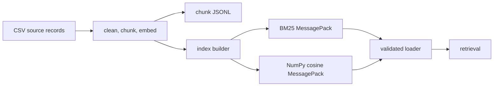

# Artifact Contracts

Ingest produces two durable handoff formats: JSONL chunk streams and MessagePack
retrieval indexes. The formats solve different problems. JSONL exposes records
for inspection and exchange; an index preserves backend-specific state for fast
loading and querying.

```mermaid
flowchart LR
    Source[CSV source records] --> Pipeline[clean, chunk, embed]
    Pipeline --> JSONL[chunk JSONL]
    Pipeline --> Build[index builder]
    Build --> BM25[BM25 MessagePack]
    Build --> Dense[NumPy cosine MessagePack]
    BM25 --> Load[validated loader]
    Dense --> Load
    Load --> Query[retrieval]
```

## Chunk JSONL

The document pipeline writes one JSON object per line. A line represents one
successful chunk or one rendered error, according to the command and output
mode. JSONL is the right boundary when records must be streamed, sampled, or
examined without loading a complete corpus.

Preserve the source file, effective chunking configuration, and embedding
identity beside the output when the file is intended for replay. A vector alone
does not identify the model or normalization policy that created it.

## Retrieval Indexes

`BM25Index.save()` and `NumpyCosineIndex.save()` write MessagePack payloads.
Both payloads carry:

- `schema_version`, which the loader checks exactly;
- `backend`, which prevents loading one representation as another;
- chunk content, source offsets, metadata, and stored `chunk_id` values; and
- the backend state required to reproduce scoring.

The BM25 payload also records token buckets, term frequencies, document
frequencies, document lengths, and scoring parameters. The dense payload records
the embedding specification plus the vector dtype, shape, and bytes. Loading
recomputes each chunk identity and rejects a mismatch as possible corruption.

An index fingerprint covers its schema, backend configuration, ordered chunk
identities, and numerical state. Use it to identify an exact built index, not as
a substitute for retaining the input and build configuration.

## Ownership and Safe Publication

The caller chooses the destination path. `save_stored_index()` reports an
expected persistence failure as `Err[str]`; the surrounding workflow remains
responsible for directory creation, access control, retention, and atomic
publication. Do not expose index files from an untrusted source: MessagePack is
decoded into typed internal structures, but payload size and array dimensions
still consume local resources.

Treat these changes as artifact-breaking:

- changing field meaning or numeric dtype without a new schema version;
- changing chunk ordering or stable-identity inputs;
- accepting a backend under the wrong discriminator; or
- removing validation that currently rejects corrupt identifiers or unsupported
  versions.

See [Data Contracts](data-contracts.md) for the in-process record shapes and
[State and Persistence](../architecture/state-and-persistence.md) for storage
ownership.
