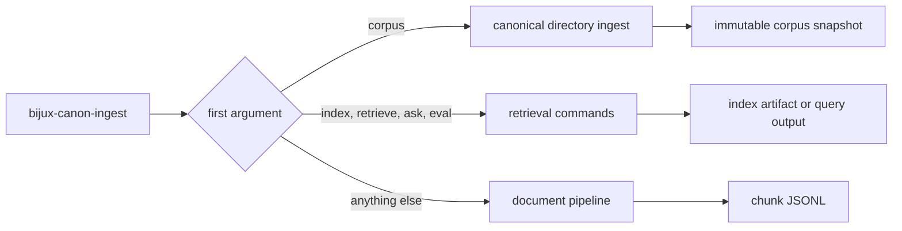

# CLI Surface

`bijux-canon-ingest` supports canonical corpus ingestion, retrieval operations,
and the configured document pipeline. If the first argument is `corpus`,
`index`, `retrieve`, `ask`, or `eval`, that operation parser owns the
invocation. Otherwise the command is interpreted as the configured document
pipeline.



## Command Map

| Form | Required inputs | Primary output |
| --- | --- | --- |
| `corpus build` | document root, logical root name, corpus name | canonical snapshot summary; optional atomic publication |
| `INPUT.csv --config CONFIG` | CSV and pipeline JSON | validation/process outcome; optional chunk JSONL |
| `index build` | CSV and output path | MessagePack index and fingerprint summary |
| `retrieve` | index and query | ranked candidate JSON |
| `ask` | index and query | extractive answer with citations in JSON or YAML |
| `eval` | index and suite directory | recall-at-k metrics and regression status |

## Build a Canonical Corpus

```bash
bijux-canon-ingest corpus build \
  --root documents \
  --root-name reviewed-documents \
  --corpus-name reviewed-documents \
  --publish-root artifacts/ingest/published
```

An adjacent `corpus.lock.json` is discovered automatically. Use
`--corpus-lock /path/to/corpus.lock.json` to select an explicit verified lock.
Lock and acquisition evidence is checked before parsing and retained in each
document's canonical metadata. If no lock is present, the command still works
with explicitly lower discovery/filename provenance. Invalid or contradictory
lock evidence exits with status `2` and includes its stable refusal code on
stderr. Successful JSON includes a portable `corpus_lock` summary with the
verified schema, identity, source count, and discovery mode, or `status` equal
to `absent` for an unlocked directory. With `--publish-root`, the result also
declares `disposition` as `initial`, `unchanged`, or `changed`. A restorable
prior generation supplies an exact `delta`; unchanged runs reuse every eligible
document after restart without invoking its parser, while changed runs name
the precise additions, modifications, deletions, renames, tombstones, and
chunk invalidations.

Directory traversal is bounded by default. Use `--max-depth`, `--max-entries`,
`--max-files`, `--max-file-bytes`, `--max-total-bytes`, and `--max-seconds` to
select stricter or explicitly reviewed limits. A limit refusal exits with
status `2` and its stable `*_limit_exceeded` code; it never publishes the files
seen before exhaustion as a complete snapshot. `--symlink-policy` defaults to
`reject`; the two within-root modes still reject escapes and cycles.

## Configured Document Pipeline

```bash
bijux-canon-ingest documents.csv \
  --config pipeline.json \
  --set chunk.chunk_size=384 \
  --out artifacts/ingest/chunks.jsonl
```

`--set` is repeatable and accepts dotted `key=value` overrides. The command
loads all admissible documents, builds the configured step sequence, and writes
only successful chunks when `--out` is present. The JSONL file does not contain
error rows or a run manifest; retain the command outcome and effective
configuration separately.

## Build an Index

```bash
bijux-canon-ingest index build \
  --input documents.csv \
  --out artifacts/ingest/corpus.index \
  --backend bm25 \
  --chunk-size 384 \
  --overlap 48 \
  --tail-policy emit_short
```

`--backend` accepts `bm25` or `numpy-cosine`. Dense indexes accept `hash16` or
the optional `sbert` embedder; `--sbert-model` selects the external model.
The command prints JSON containing the output path, fingerprint, and backend.

## Retrieve and Answer

```bash
bijux-canon-ingest retrieve \
  --index artifacts/ingest/corpus.index \
  --query "retention period" \
  --top-k 5 \
  --filter category=governance \
  --out artifacts/ingest/candidates.json

bijux-canon-ingest ask \
  --index artifacts/ingest/corpus.index \
  --query "How long are signed records retained?" \
  --top-k 5 \
  --format json \
  --out artifacts/ingest/answer.json
```

`--filter key=value` is repeatable. `ask` reranks by default; use
`--no-rerank` to preserve the initial candidate order. YAML output requires the
optional PyYAML dependency.

## Evaluate

```bash
bijux-canon-ingest eval \
  --index artifacts/ingest/corpus.index \
  --suite evaluation/retention \
  --k 10 \
  --baseline evaluation/retention/baseline.json \
  --tolerance 0.01
```

The suite directory must contain `queries.jsonl`. Each usable row supplies a
query and relevant document IDs. The command returns status `1` when recall
falls below the baseline beyond tolerance and `2` when the suite is missing.

## Automation Contract

Pipeline argument or parse failures use status `2`; governed pipeline failures
use status `1`; success uses status `0`. Retrieval commands emit machine-readable
JSON for their principal results, but unexpected file, dependency, or payload
errors can still terminate through the command runtime. Scripts should capture
stderr, require the expected output file, and validate its schema before
publication.

See [Artifact Contracts](artifact-contracts.md) before treating JSONL or an index
as a durable handoff.
