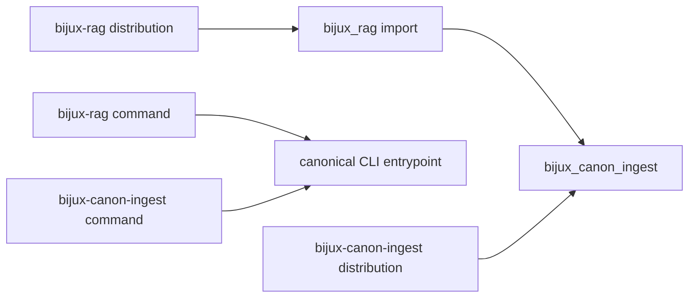
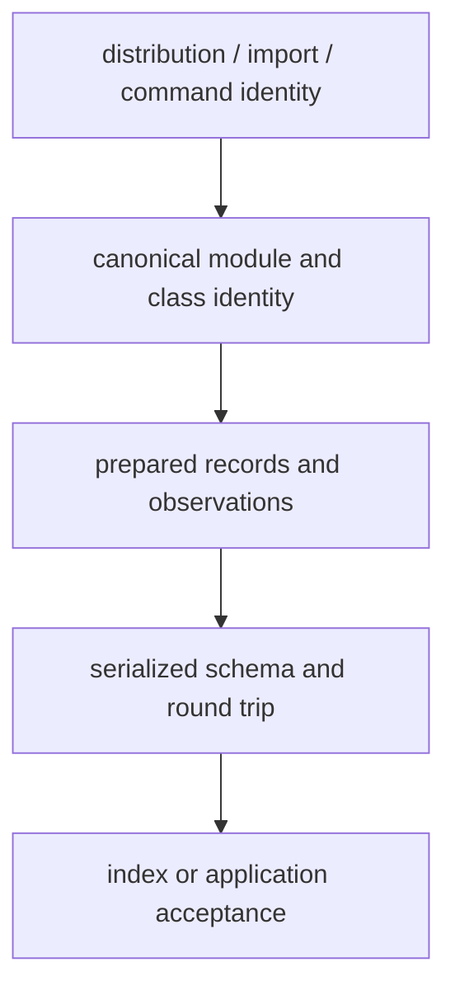

# Compatibility Commitments

The canonical distribution is `bijux-canon-ingest`, its Python package is
`bijux_canon_ingest`, and its command is `bijux-canon-ingest`. These names are
the forward-facing contract.

`bijux-rag` remains a compatibility distribution for existing environments. It
installs the `bijux_rag` import and the `bijux-rag` command, then delegates to
the canonical package at the same synchronized version.



## What the Alias Preserves

The alias forwards the canonical root `__all__`, attribute access, interactive
discovery, and runtime submodule imports. Existing code can therefore migrate
the dependency, import, and command independently:

```python
# Compatibility import
from bijux_rag import RawDoc, run_ingest_pipeline_docs

# Canonical import
from bijux_canon_ingest import RawDoc, run_ingest_pipeline_docs
```

Both names resolve to canonical implementations. The alias is not an
independent fork and does not define a second behavioral contract.

## Separate Name, Code, Data, And Behavior

Compatibility must be established at every boundary a consumer uses:

| Dimension | Governing evidence | A false positive |
| --- | --- | --- |
| package identity | exact same-release dependency from `bijux-rag` to `bijux-canon-ingest` | both distributions happen to install |
| Python identity | root export parity and canonical nested module/class identity | similarly named wrapper classes |
| command identity | direct canonical entrypoint target, arguments, output, and exit status | both commands print help |
| prepared data | source IDs, normalized content, chunk spans, embeddings, metadata, and typed failures | equal chunk count |
| serialized boundary | schema version or snapshot, round trip, and reader behavior | JSON parses successfully |
| retrieval helper boundary | backend capability, index fingerprint, ranking, and error semantics | one query returns plausible results |



Passing a layer does not imply that the next layer passed. An alias can resolve
perfectly while an old artifact reader, cache key, or downstream assumption is
incompatible.

## What Compatibility Does Not Promise

- Private modules and names absent from the canonical `__all__` are not stable.
- Serialized indexes remain governed by their own `schema_version`; an import
  alias cannot make an incompatible artifact readable.
- Optional integration dependencies remain optional under both names.
- An old command invocation does not preserve undocumented output ordering,
  filesystem permissions, or third-party model behavior.

Optional dependencies are part of the chosen capability boundary. The core
facade remaining importable does not establish that a retrieval backend, model
client, HTTP server, or accelerated implementation is installed or compatible.

## Change Classification

| Change | Expected treatment |
| --- | --- |
| add a root export without changing existing semantics | backward-compatible feature with API inventory coverage |
| remove, rename, or change a root export | compatibility decision and migration path |
| change normalization or chunk-boundary semantics | behavioral contract change with fixed-corpus evidence |
| change a serialized model or index schema | versioned schema change with reader/writer migration evidence |
| change fingerprint inputs | identity change that must be visible in regression and cache behavior |
| reorganize an undocumented internal module | implementation change unless a supported facade is affected |

## Migration

Prefer the canonical names in new code. For an existing deployment, change one
surface at a time and run its normal preparation proof after each change:

1. Replace the distribution dependency with `bijux-canon-ingest`.
2. Replace `bijux_rag` imports with `bijux_canon_ingest`.
3. Replace `bijux-rag` command invocations with `bijux-canon-ingest`.
4. Search dynamic imports, plugins, configuration, serialized dotted paths,
   cache keys, and artifact readers for `bijux_rag` identities.
5. Compare source identities, normalized records, chunk spans, embeddings,
   observations, and typed failures on a fixed corpus.
6. Validate serialization round trips and the first downstream consumer.

## Migration Acceptance

The bridge is no longer required by a consumer only when:

- its manifests and lock files resolve `bijux-canon-ingest` directly;
- source and dynamic imports use `bijux_canon_ingest`;
- automation invokes `bijux-canon-ingest`;
- retained configuration and serialized metadata contain no required
  `bijux_rag.*` paths;
- representative preparation output and failure semantics match the intended
  canonical contract; and
- deployed environments do not independently request the compatibility
  distribution.

The compatibility package can remain installed during a staged consumer
migration, but applications should avoid mixing alias and canonical imports in
the same module because that obscures ownership during review.

See the [compatibility package catalog](../../08-compat-packages/catalog/bijux-rag.md)
for packaging details.
