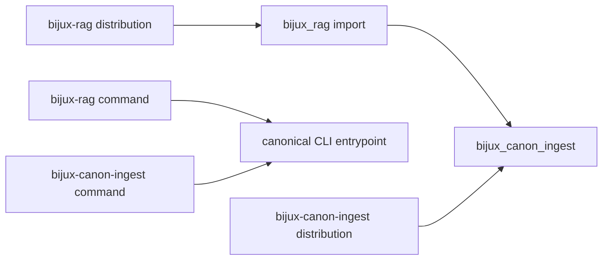

# Compatibility Commitments

The canonical distribution is `bijux-canon-ingest`, its Python package is
`bijux_canon_ingest`, and its command is `bijux-canon-ingest`. These names are
the forward-facing contract.

`bijux-rag` remains a compatibility distribution for existing environments. It
installs the `bijux_rag` import and the `bijux-rag` command, then delegates to
the canonical package at the same synchronized version.



## What the Alias Preserves

The alias forwards the canonical root `__all__`, attribute access, interactive
discovery, and runtime submodule imports. Existing code can therefore migrate
the dependency, import, and command independently:

```python
# Compatibility import
from bijux_rag import RawDoc, run_ingest_pipeline_docs

# Canonical import
from bijux_canon_ingest import RawDoc, run_ingest_pipeline_docs
```

Both names resolve to canonical implementations. The alias is not an
independent fork and does not define a second behavioral contract.

## What Compatibility Does Not Promise

- Private modules and names absent from the canonical `__all__` are not stable.
- Serialized indexes remain governed by their own `schema_version`; an import
  alias cannot make an incompatible artifact readable.
- Optional integration dependencies remain optional under both names.
- An old command invocation does not preserve undocumented output ordering,
  filesystem permissions, or third-party model behavior.

## Migration

Prefer the canonical names in new code. For an existing deployment, change one
surface at a time and run its normal ingest and retrieval proof after each
change:

1. Replace the distribution dependency with `bijux-canon-ingest`.
2. Replace `bijux_rag` imports with `bijux_canon_ingest`.
3. Replace `bijux-rag` command invocations with `bijux-canon-ingest`.
4. Compare output chunk identities and index fingerprints on a fixed corpus.

The compatibility package can remain installed during a staged consumer
migration, but applications should avoid mixing alias and canonical imports in
the same module because that obscures ownership during review.

See the [compatibility package catalog](../../08-compat-packages/catalog/bijux-rag.md)
for packaging details.
