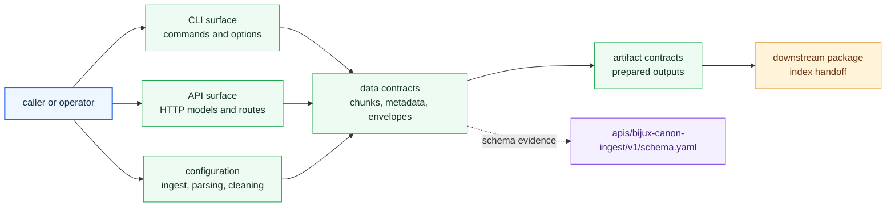

# Interfaces

Open this section when the question is contractual: which ingest commands, schemas, records, artifacts, and imports are safe for another tool or package to rely on.

## Contract Surface

Ingest exposes more than one kind of interface. Operators reach it through CLI
and HTTP surfaces, package callers rely on imports and serialized records, and
downstream packages consume artifacts that must remain stable enough to review.
This section should name those promises before a reader has to inspect code.

## Read These First

- open [Data Contracts](https://bijux.io/bijux-canon/02-bijux-canon-ingest/interfaces/data-contracts/) first when the dispute is about record shape, chunk structure, or prepared payload layout
- open [CLI Surface](https://bijux.io/bijux-canon/02-bijux-canon-ingest/interfaces/cli-surface/) when the issue begins with an operator or scripted entrypoint
- open [Compatibility Commitments](https://bijux.io/bijux-canon/02-bijux-canon-ingest/interfaces/compatibility-commitments/) when a surface change may break downstream assumptions

## Contract Risk

The main contract risk here is letting downstream packages rely on visible ingest behavior that was never named as a real contract.

## First Proof Check

- `packages/bijux-canon-ingest/src/bijux_canon_ingest/interfaces` for CLI, HTTP, serialization, and error bridges
- `packages/bijux-canon-ingest/src/bijux_canon_ingest/config` for caller-visible ingest, parsing, and cleaning settings
- `apis/bijux-canon-ingest/v1/schema.yaml` for tracked schema evidence
- `packages/bijux-canon-ingest/tests` and examples for proof that exposed ingest behavior is intentional

## Pages In This Section

- [CLI Surface](https://bijux.io/bijux-canon/02-bijux-canon-ingest/interfaces/cli-surface/)
- [API Surface](https://bijux.io/bijux-canon/02-bijux-canon-ingest/interfaces/api-surface/)
- [Configuration Surface](https://bijux.io/bijux-canon/02-bijux-canon-ingest/interfaces/configuration-surface/)
- [Data Contracts](https://bijux.io/bijux-canon/02-bijux-canon-ingest/interfaces/data-contracts/)
- [Artifact Contracts](https://bijux.io/bijux-canon/02-bijux-canon-ingest/interfaces/artifact-contracts/)
- [Entrypoints and Examples](https://bijux.io/bijux-canon/02-bijux-canon-ingest/interfaces/entrypoints-and-examples/)
- [Operator Workflows](https://bijux.io/bijux-canon/02-bijux-canon-ingest/interfaces/operator-workflows/)
- [Public Imports](https://bijux.io/bijux-canon/02-bijux-canon-ingest/interfaces/public-imports/)
- [Compatibility Commitments](https://bijux.io/bijux-canon/02-bijux-canon-ingest/interfaces/compatibility-commitments/)

## Leave This Section When

- leave for [Foundation](https://bijux.io/bijux-canon/02-bijux-canon-ingest/foundation/) when the contract dispute is really a package-boundary dispute
- leave for [Architecture](https://bijux.io/bijux-canon/02-bijux-canon-ingest/architecture/) when a surface question reveals structural drift underneath it
- leave for [Operations](https://bijux.io/bijux-canon/02-bijux-canon-ingest/operations/) or [Quality](https://bijux.io/bijux-canon/02-bijux-canon-ingest/quality/) when the boundary is clear and the question becomes execution or proof

## Bottom Line

A surface is not a real contract until the docs, code, and tests agree that it is one.
