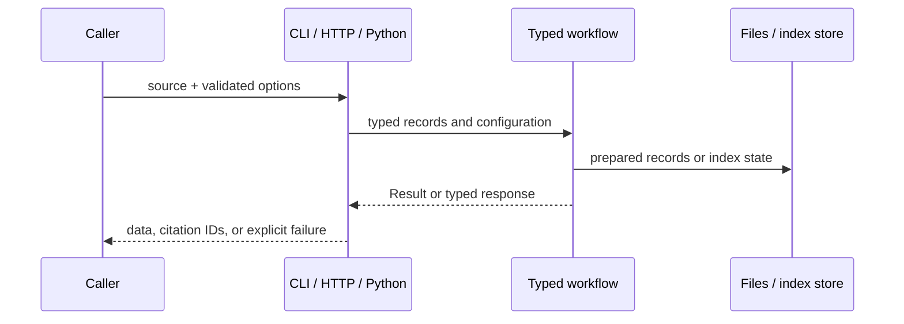

# Interfaces

Ingest exposes one preparation and retrieval model through Python, command-line,
HTTP, and file contracts. These surfaces share concepts but are not aliases:
each has its own lifecycle, serialization, and failure boundary.

## Surface map

| Surface | Intended use | Durable contract | Lifecycle |
| --- | --- | --- | --- |
| Python imports | library composition and custom pipelines | exported records, results, functions, and protocols | caller-owned |
| `bijux-canon-ingest` CLI | file preparation and local retrieval workflows | exit status, stdout/stderr, files, and command arguments | process-scoped |
| HTTP v1 | service integration for chunk, index, retrieve, and ask | versioned routes and request/response schemas | server-scoped |
| CSV and JSONL | input and inspectable prepared records | documented field names and encodings | file-scoped |
| MessagePack index | local retrieval persistence | package format plus matching chunk records | directory-scoped |
| `bijux-rag` | compatibility for the former distribution/import surface | forwarding behavior documented by compatibility policy | migration-scoped |

## Contract path

```mermaid
sequenceDiagram
    participant Caller
    participant Edge as CLI / HTTP / Python
    participant Core as Typed workflow
    participant Store as Files / index store
    Caller->>Edge: source + validated options
    Edge->>Core: typed records and configuration
    Core->>Store: prepared records or index state
    Core-->>Edge: Result or typed response
    Edge-->>Caller: data, citation IDs, or explicit failure
```

## Identity and serialization

Document and chunk identifiers are part of reproducibility: they connect
prepared text, ranked results, and citations. Chunk offsets address normalized
text. Callers that require original byte offsets must retain their own source
mapping rather than reinterpret these values.

`ChunkModel` is the edge representation used by interface adapters, while the
retrieval `Chunk` carries the retrieval workflow's data. Conversion is an
explicit projection; code must not assume every internal field or embedding
survives every serialized representation.

## Failure contracts

- Python workflows use typed results and exceptions according to the documented
  API boundary; callers should not parse exception strings as protocol fields.
- CLI automation relies on documented exit status and output destinations.
- HTTP clients rely on v1 status codes and error payloads, not server logs.
- Optional dependency failures identify the unavailable capability. Installing
  an optional provider must be an explicit application decision.
- Index files and their chunk records form one logical artifact and must be
  copied, versioned, and recovered together.

## Choose the relevant contract

| Need | Guide |
| --- | --- |
| Script or operate commands | [CLI surface](cli-surface.md) |
| Integrate with the HTTP application | [API surface](api-surface.md) |
| Select environment and file settings | [Configuration surface](configuration-surface.md) |
| Consume records and chunk identities | [Data contracts](data-contracts.md) |
| Persist or transfer outputs | [Artifact contracts](artifact-contracts.md) |
| Compose the library directly | [Public imports](public-imports.md) |
| Follow complete caller journeys | [Operator workflows](operator-workflows.md) |
| Assess a breaking change | [Compatibility commitments](compatibility-commitments.md) |
| Start from runnable code | [Entrypoints and examples](entrypoints-and-examples.md) |
