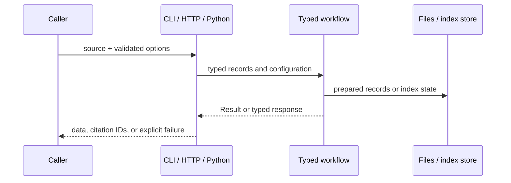

# Interfaces

Ingest exposes one preparation and retrieval model through Python, command-line,
HTTP, and file contracts. These surfaces share concepts but are not aliases:
each has its own lifecycle, serialization, and failure boundary.

## Surface map

| Surface | Intended use | Durable contract | Lifecycle |
| --- | --- | --- | --- |
| Python imports | library composition and custom pipelines | exported records, results, functions, and protocols | caller-owned |
| `bijux-canon-ingest` CLI | file preparation and local retrieval workflows | exit status, stdout/stderr, files, and command arguments | process-scoped |
| HTTP v1 | service integration for chunk, index, retrieve, and ask | versioned routes and request/response schemas | server-scoped |
| CSV and JSONL | input and inspectable prepared records | documented field names and encodings | file-scoped |
| MessagePack index | local retrieval persistence | package format plus matching chunk records | directory-scoped |
| `bijux-rag` | compatibility for the former distribution/import surface | forwarding behavior documented by compatibility policy | migration-scoped |

## Contract path

```mermaid
sequenceDiagram
    participant Caller
    participant Edge as CLI / HTTP / Python
    participant Core as Typed workflow
    participant Store as Files / index store
    Caller->>Edge: source + validated options
    Edge->>Core: typed records and configuration
    Core->>Store: prepared records or index state
    Core-->>Edge: Result or typed response
    Edge-->>Caller: data, citation IDs, or explicit failure
```

## Identity and serialization

Document and chunk identifiers are part of reproducibility: they connect
prepared text, ranked results, and citations. Chunk offsets address normalized
text. Callers that require original byte offsets must retain their own source
mapping rather than reinterpret these values.

`ChunkModel` is the edge representation used by interface adapters, while the
retrieval `Chunk` carries the retrieval workflow's data. Conversion is an
explicit projection; code must not assume every internal field or embedding
survives every serialized representation.

## Preserve custody across surfaces

The same document can cross several interfaces without every representation
being interchangeable. Preserve these identities before changing surfaces:

| Decision | Python representation | Serialized or service representation | Refuse the handoff when |
| --- | --- | --- | --- |
| source acceptance | `RawDoc` identity and submitted fields | CSV row or HTTP document payload | the source identifier is absent, unstable, or reused for different content |
| normalization | `CleanDoc` plus effective `CleanConfig` | prepared record plus retained configuration | only normalized text remains and the applied rules cannot be recovered |
| segmentation | chunk parent, offsets, text, and geometry | JSONL `ChunkModel` or HTTP chunk response | offsets are reinterpreted as original-byte positions or the parent is missing |
| local indexing | ordered chunks, backend choice, and index identity | MessagePack index directory with matching chunk records | index state and records were copied, versioned, or restored separately |
| retrieval | query, index identity, candidate IDs, scores, and citations | CLI JSON, HTTP response, or typed retrieval result | an empty result conceals a load, capability, or validation failure |

Choose one representation as the system of record for each boundary. A caller
may project that record into another surface, but it must retain the owning
identity and configuration beside the projection. Round-tripping through a
smaller response model cannot restore an omitted embedding, source mapping, or
failure disposition.

## Choose by custody requirement

Choose an interface by who must retain the preparation record after the call,
not only by which transport is convenient:

| Requirement | Prefer | Caller must retain |
| --- | --- | --- |
| compose deterministic transforms inside an application | Python root and named application modules | typed input, effective configuration, results and typed failures |
| publish a reviewable prepared corpus | configured CLI pipeline | original source identity, configuration file content, closed JSONL output and failure summary |
| build a small local retrieval artifact | retrieval CLI or application service | backend choice, index directory, matching chunk records and corpus fingerprint |
| provide bounded request/response integration | HTTP v1 | request payload, response or structured error, service version and index-lifecycle assumptions |
| preserve an existing `bijux-rag` consumer | compatibility import or command | exact canonical version and evidence that caller-visible behavior remains equivalent |

The interfaces are deliberately not feature-equivalent. Python exposes the
widest composition surface; the preparation CLI owns file-oriented bulk work;
HTTP exposes five bounded operations with process-local default storage; and
CSV, JSONL, and MessagePack are artifact contracts rather than execution
engines. Moving between them is an adapter decision that must preserve the
preparation receipt described in the handbook.

## Failure contracts

- Python workflows use typed results and exceptions according to the documented
  API boundary; callers should not parse exception strings as protocol fields.
- CLI automation relies on documented exit status and output destinations.
- HTTP clients rely on v1 status codes and error payloads, not server logs.
- Optional dependency failures identify the unavailable capability. Installing
  an optional provider must be an explicit application decision.
- Index files and their chunk records form one logical artifact and must be
  copied, versioned, and recovered together.

## Choose the relevant contract

| Need | Guide |
| --- | --- |
| Script or operate commands | [CLI surface](cli-surface.md) |
| Integrate with the HTTP application | [API surface](api-surface.md) |
| Select environment and file settings | [Configuration surface](configuration-surface.md) |
| Consume records and chunk identities | [Data contracts](data-contracts.md) |
| Persist or transfer outputs | [Artifact contracts](artifact-contracts.md) |
| Compose the library directly | [Public imports](public-imports.md) |
| Follow complete caller journeys | [Operator workflows](operator-workflows.md) |
| Assess a breaking change | [Compatibility commitments](compatibility-commitments.md) |
| Start from runnable code | [Entrypoints and examples](entrypoints-and-examples.md) |
