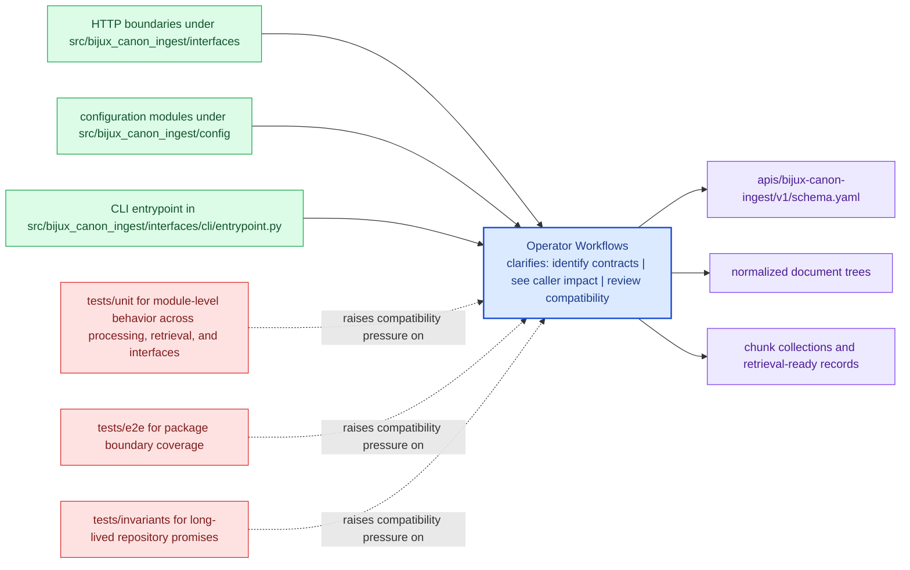

# Operator Workflows

Operator workflows should start from documented package entrypoints and end in reviewable outputs.

This page connects interface prose to real use. A reader should leave with a
picture of how commands, APIs, inputs, and outputs hang together in a workflow
an operator can actually repeat.

Treat the interfaces pages for `bijux-canon-ingest` as the bridge between implementation detail and caller expectation. They should show what the package is prepared to defend before a dependency forms.

## Visual Summary

## Workflow Anchors

- entry surfaces: CLI entrypoint in src/bijux_canon_ingest/interfaces/cli/entrypoint.py, HTTP boundaries under src/bijux_canon_ingest/interfaces, configuration modules under src/bijux_canon_ingest/config
- durable outputs: normalized document trees, chunk collections and retrieval-ready records, diagnostic output produced during ingest workflows
- validation backstops: tests/unit for module-level behavior across processing, retrieval, and interfaces, tests/e2e for package boundary coverage

## Concrete Anchors

- CLI entrypoint in src/bijux_canon_ingest/interfaces/cli/entrypoint.py
- HTTP boundaries under src/bijux_canon_ingest/interfaces
- configuration modules under src/bijux_canon_ingest/config
- apis/bijux-canon-ingest/v1/schema.yaml

## Use This Page When

- you need the public command, API, import, schema, or artifact surface
- you are checking whether a caller can safely rely on a given entrypoint or shape
- you want the contract-facing side of the package before building on it

## Decision Rule

Use `Operator Workflows` to decide whether a caller-facing surface is explicit enough to depend on. If the surface cannot be tied back to concrete code, schemas, artifacts, examples, and tests, treat it as unstable until that evidence is visible.

## What This Page Answers

- which public or operator-facing surfaces `bijux-canon-ingest` is really asking readers to trust
- which schemas, artifacts, imports, or commands behave like contracts
- what compatibility pressure a change to this surface would create

## Reviewer Lens

- compare commands, schemas, imports, and artifacts against the documented surface one by one
- check whether a seemingly local change actually needs compatibility review
- confirm that examples still point to real entrypoints and not to stale habits

## Honesty Boundary

This page can identify the intended public surfaces of `bijux-canon-ingest`, but real compatibility depends on code, schemas, artifacts, examples, and tests staying aligned. If those disagree, the prose is wrong or incomplete.

## Next Checks

- move to operations when the caller-facing question becomes procedural or environmental
- move to quality when compatibility or evidence of protection becomes the real issue
- move back to architecture when a public-surface question reveals a deeper structural drift

## Purpose

This page connects package interfaces to the workflows an operator actually performs.

## Stability

Keep it aligned with the existing commands, endpoints, and outputs.
