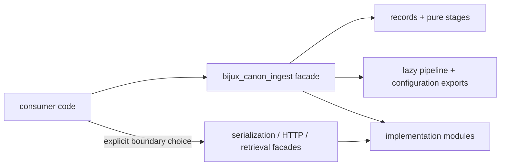

# Public Imports

Import supported application building blocks from `bijux_canon_ingest`. The
package root is the compatibility boundary; implementation modules beneath
`application`, `infra`, `interfaces`, and `processing` may change as ownership
is refined.

## Import Stability Model

| Level | Examples | Commitment |
| --- | --- | --- |
| root facade | `RawDoc`, `Chunk`, `clean_doc`, `run_ingest_pipeline_docs`, `Result` | supported application API; removals or semantic changes require an explicit compatibility decision |
| documented boundary namespace | `interfaces.serialization`, `interfaces.http`, `retrieval` | supported for consumers that deliberately adopt that boundary and its versioned contracts |
| concrete implementation module | individual files below `application`, `processing`, `infra`, or CLI internals | reachable for repository composition, but not a stable consumer import merely because Python can load it |
| private package machinery | `_package_api`, `_lazy_exports`, underscore-prefixed names | internal; may change without consumer migration support |



The arrows into implementation modules describe repository composition, not a
recommendation for consumer imports.

## Common Entry Points

| Need | Root imports |
| --- | --- |
| records | `RawDoc`, `CleanDoc`, `ChunkWithoutEmbedding`, `Chunk` |
| processing | `clean_doc`, `chunk_doc`, `embed_chunk`, `structural_dedup_chunks` |
| complete ingestion | `run_ingest_pipeline`, `run_ingest_pipeline_docs`, `run_ingest_pipeline_path` |
| streaming ingestion | `iter_ingest_pipeline`, `iter_ingest_pipeline_core`, `stream_chunks` |
| configuration | `IngestConfig`, `IngestDeps`, `IngestBoundaryDeps`, `build_ingest_deps` |
| explicit outcomes | `Result`, `Ok`, `Err`, `ErrInfo`, `Option`, `Some`, `NONE` |
| safeguards | `retry_map_iter`, circuit breakers, error-report folds, `DiskCache` |
| composition | `Source`, `Transform`, `compose_transforms`, `multicast`, `throttle` |

The root also exposes tree folds, functional composition primitives,
instrumentation, rule predicates, and bounded streaming utilities. Inspect
`bijux_canon_ingest.__all__` when generating API inventory; do not infer support
from names that happen to be reachable.

`__all__` is the machine-readable root inventory. Some entries are imported
eagerly because they are dependency-light records or pure functions; pipeline,
configuration, file, and exception-boundary helpers are resolved lazily. The
lazy mechanism changes import cost, not the public meaning of those names.

## Minimal Pipeline

```python
from bijux_canon_ingest import (
    IngestConfig,
    RagEnv,
    RawDoc,
    build_ingest_deps,
    run_ingest_pipeline_docs,
)

documents = [
    RawDoc(
        doc_id="paper-7",
        title="Example",
        abstract="A reproducible source record for ingestion.",
        categories="methods",
    )
]

config = IngestConfig(env=RagEnv(chunk_size=256))
dependencies = build_ingest_deps(config)
chunks, observations = run_ingest_pipeline_docs(documents, config, dependencies)
```

Pipeline and configuration helpers are resolved lazily. Importing the package
root therefore keeps low-level use lightweight while preserving one stable
surface for application callers.

The returned chunks are canonical ingest records and the observations describe
the preparation work. Their presence does not prove that a downstream index
accepted the records or that retrieval quality is adequate; those are separate
contracts.

## Boundary-Specific Imports

Some contracts intentionally live below the root because using them opts into
a particular boundary:

```python
from bijux_canon_ingest.interfaces.serialization import (
    ChunkModel,
    deserialize_model,
    serialize_model,
)
from bijux_canon_ingest.retrieval import BM25Index, NumpyCosineIndex
```

Use these documented namespaces only when the boundary matters. Avoid importing
underscore-prefixed modules, `_package_api`, concrete infrastructure adapters,
or CLI parser internals. Those are implementation surfaces, even when Python
can resolve them.

## Select An Import By The Decision You Own

| Consumer responsibility | Import from | Validate separately |
| --- | --- | --- |
| construct and transform ingest records | package root | record invariants and typed results |
| run the configured preparation pipeline | package root | configuration, dependencies, observations, and failures |
| persist or exchange serialized records | `interfaces.serialization` | schema snapshot and round-trip behavior |
| embed retrieval helpers directly | `retrieval` | backend capability, fingerprint, ranking, and optional dependencies |
| expose the HTTP application | `interfaces.http` | OpenAPI schema and HTTP error semantics |

Do not pass HTTP validation models into core processing merely because their
fields resemble `RawDoc` or `Chunk`. Map at the boundary so validation,
defaults, and serialization remain explicit.

## Upgrade Safely

Before upgrading, inventory root imports and any documented boundary
namespaces separately. For root-only consumers, import and focused behavioral
tests are the primary evidence. Serialization, retrieval, and HTTP consumers
also need schema, fingerprint, ranking, or OpenAPI evidence appropriate to the
boundary they chose.

`bijux_rag` forwards the canonical root for compatibility. New integrations
should use `bijux_canon_ingest`; see [Compatibility Commitments](compatibility-commitments.md)
for the migration contract.
