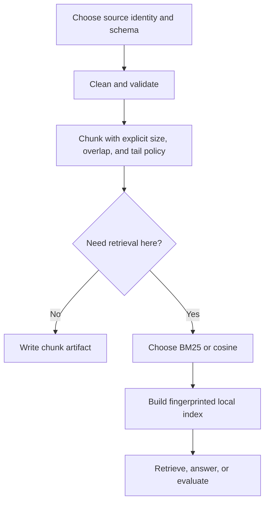

# Common Workflows

The ingest package supports three recurring operating shapes: deterministic
source preparation, a self-contained local retrieval loop, and a service
boundary for applications that submit documents over HTTP.



## Prepare a reproducible chunk corpus

Use this path when another package or system will own retrieval.

1. Assign every source a stable `doc_id`; do not derive it from input order.
2. Normalize the source into `RawDoc` records or the CLI CSV schema.
3. Pin `chunk_size`, `overlap`, and `tail_policy` in configuration.
4. Run cleaning before chunking so offsets refer to the normalized text that
   downstream consumers receive.
5. Write JSONL to a versioned artifact location and retain the configuration
   beside it.

Chunk identity incorporates document identity, offsets, and text. Changing
normalization or chunk policy therefore changes the resulting corpus and
should be reviewed as a data-contract change.

## Build a local retrieval corpus

Use `bm25` when lexical matching, dependency-light operation, and deterministic
reconstruction are the priorities. Use `numpy-cosine` when semantic proximity
is required and the embedding boundary is acceptable.

For cosine indexes:

- `hash16` is deterministic and useful for contract tests and small controlled
  workflows; it is not a semantic language model.
- `sbert` requires the optional model dependency. Record the model name and
  version with the index artifact because model behavior is external to the
  pure ingest transforms.

After building, use `retrieve` to inspect ranked evidence before relying on
`ask`. The answer command is extractive and returns citations; it does not turn
the ingest package into an open-ended reasoning system.

## Evaluate retrieval changes

An evaluation suite is a directory containing `queries.jsonl`. Run it against
the candidate index and, when changing corpus or retrieval configuration,
compare it with a stored baseline:

```bash
bijux-canon-ingest eval \
  --index artifacts/ingest/corpus.index \
  --suite evaluation/retention \
  --k 10 \
  --baseline evaluation/retention/baseline.json \
  --tolerance 0.01
```

A tolerated metric change is still evidence to review. Keep the query suite,
baseline, corpus identity, and index configuration together so a result can be
reconstructed.

## Operate the HTTP adapter

The FastAPI adapter is suitable for a process-local service or for embedding in
an application that provides its own lifecycle and persistence policy.

- Check `GET /v1/healthz` for liveness.
- Build an index before calling retrieve or ask.
- Retain the returned `index_id` only for the lifetime of the service process.
- Treat HTTP `422` as request-schema failure, `404` as an unknown index, and
  `400` as a rejected ingest or retrieval operation.
- Put authentication, request limits, durable index storage, and deployment
  policy in the hosting application; the package adapter does not invent them.

## Recover from partial failures

Library pipelines expose expected failures as `Result` values. Choose the
collector that matches the operating policy:

- fail fast when any rejected source invalidates the corpus;
- partition successes and errors when valid documents may proceed;
- cap collected errors or stop at an error-rate threshold for large streams;
- retry only errors classified as retriable, then restore input order if order
  is part of the downstream contract;
- use circuit breakers around external adapters, not around deterministic pure
  stages.

Observability taps are deliberately observational. If adding a trace or metric
changes the emitted chunks, the instrumentation has crossed the package
contract and should be removed from the data path.

## Handoff checklist

Before handing chunks or a local index to another system, retain:

- source dataset identity and schema;
- cleaning and chunk configuration;
- embedder and model identity when embeddings are present;
- emitted chunk or index artifact and its fingerprint;
- structured error report for rejected sources;
- evaluation result when retrieval behavior changed.
