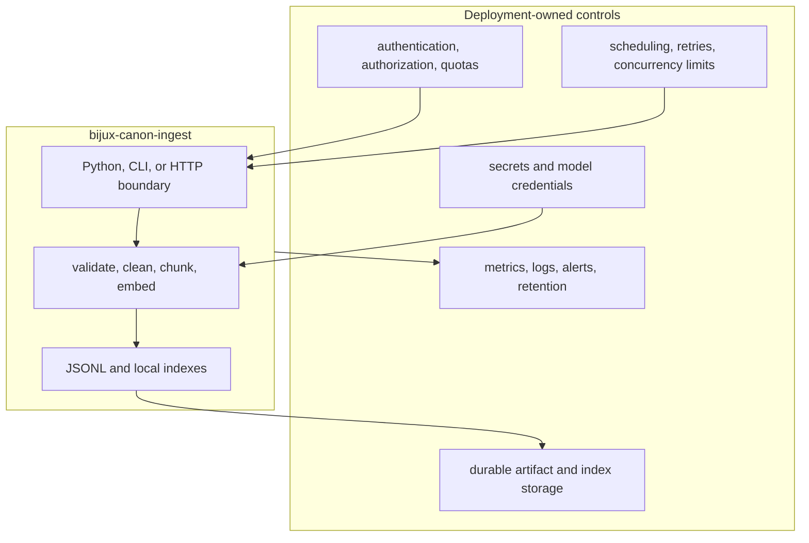

# Deployment Boundaries

`bijux-canon-ingest` can run as an embedded library, a batch CLI, or a local
HTTP adapter. It provides deterministic transformations and package-local
artifacts. The application that deploys it owns identity, isolation, resource
limits, durable service state, and the lifecycle of external effects.

## Responsibility boundary

## Supported deployment shapes

| Shape | Appropriate use | Important limit |
| --- | --- | --- |
| Embedded Python | Applications that already own IO and lifecycle | The caller owns resource construction, shutdown, and artifact placement |
| Batch CLI | Reproducible CSV-to-artifact jobs and local retrieval workflows | Automation must retain exit status, resolved configuration, and rejection evidence |
| HTTP v1 | Trusted local integration or a host-protected service adapter | The packaged server has process-local indexes and no built-in auth, tenancy, or production quota policy |

The package is independently installable. A deployment should depend on its
published package metadata and entry point, not on imports from a monorepo
checkout or sibling test fixtures.

## State and durability

JSONL outputs and versioned local index files are the durable package-owned
forms. The HTTP registry is memory resident: restart, replication, or routing
to another worker loses access to an `index_id`. Multi-worker service designs
therefore need an application-owned persistent index catalog and a stable
authorization model.

File output uses package adapters, but path ownership remains external. The
host selects names, permissions, capacity, backup, retention, encryption, and
tenant namespaces. Concurrent writers require host-level coordination; a
successful local atomic replacement is not a distributed transaction.

## Production controls

A production host supplies:

- request, document, corpus, chunk-count, memory, and execution-time limits;
- authentication and authorization before source text or citations cross the
  HTTP boundary;
- per-tenant artifact, cache, and model namespaces;
- pinned model and dependency provenance with controlled model caches;
- bounded retries, concurrency, queues, and circuit-breaker policy for
  external adapters;
- secret injection that keeps credentials out of configuration and evidence;
- monitoring for rejected inputs, partial results, breaker state, latency,
  resource exhaustion, and artifact-write failure;
- retention and deletion policy for source text, vectors, citations, indexes,
  logs, and evaluation reports.

## Deployment acceptance

Before serving production traffic, verify that a clean environment can install
the package, invoke the selected interface, and round-trip a representative
artifact. Confirm restart behavior, worker routing, concurrent-write policy,
model availability, and failure recovery. Exercise malformed and oversized
inputs without leaking source text or exception causes.

The [security and safety](security-and-safety.md) guide describes the trust
boundaries. The [operations overview](index.md) connects deployment to
observability, incident response, and recovery.
