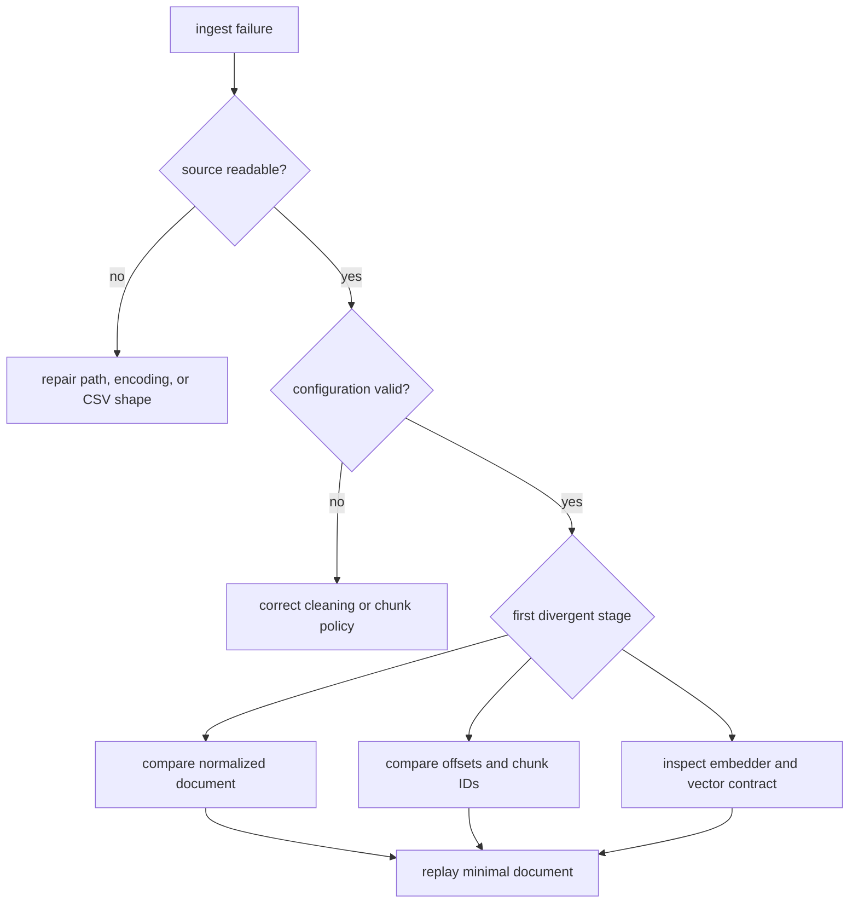

# Failure Recovery

Recover ingest runs from the first boundary that produced incorrect evidence.
The pipeline is deterministic before external embedding, so replaying the
smallest failing input is more informative than retrying the entire job.

## Triage Sequence

1. Preserve the input record, effective `IngestConfig`, output fragment, and
   error text before changing the environment.
2. Run one source record through the same predicate and cleaning rules.
3. Compare cleaned text, chunk offsets, chunk indexes, and chunk IDs.
4. Only after those values match, inspect the embedder model, vector length,
   numeric validity, timeout, and remote-service behavior.
5. Rebuild the downstream index only after the corrected chunk artifact passes
   validation.

## Failure Classes

| Symptom | Likely boundary | Recovery action |
| --- | --- | --- |
| no records produced | source reader or keep predicate | validate CSV fields and predicate against one record |
| changed chunk IDs | cleaning or segmentation | compare normalized text, offsets, and chunk policy |
| duplicate or missing chunks | structural dedup or source identity | inspect `doc_id`, offsets, and pre-dedup samples |
| vector rejected | embedder/index boundary | confirm finite values, dimension, and `EmbeddingSpec` |
| partial JSONL | file boundary interruption | discard the incomplete artifact and rerun to a fresh path |
| repeated transient error | external effect | apply bounded retry only where the operation is idempotent |
| breaker remains open | dependency instability | wait for the configured recovery window and verify the dependency independently |

## Observability Without Data Mutation

Enable the smallest useful trace surface. Stage flags can expose documents,
accepted records, normalized records, chunks, and embedded chunks; chunk probes
and bounded `Observations` provide counts and samples. Tap callbacks must remain
observation-only, so a diagnostic run has the same data path as an unobserved
run.

Avoid collecting unrestricted source text in shared logs. Document IDs, counts,
offsets, stable hashes, and bounded samples usually provide enough evidence to
locate a divergence without duplicating an entire corpus.

## Retry Safety

The safeguards package distinguishes pure `Result` retry from effectful
`IOPlan` retry. Retrying is safe only when the operation is explicitly
idempotent and the failure is classified as transient. Parse errors, invalid
configuration, deterministic validation failures, and stable vector mismatches
will not improve with retries.

For remote embedding, record the number of attempts and the last error. Keep
backoff and jitter bounded. A retry policy must not turn one rejected document
into an unbounded queue or duplicate a non-idempotent write.

## Recovery Exit Criteria

Recovery is complete when:

- the minimal failing record succeeds under the intended configuration;
- the resulting offsets and chunk IDs are stable across two executions;
- every embedding satisfies the recorded vector contract;
- the complete JSONL artifact parses without truncation; and
- downstream index construction consumes that artifact without suppressing an
  error.

The related [Data Contracts](../interfaces/data-contracts.md) page defines the
values that must be retained during triage.
