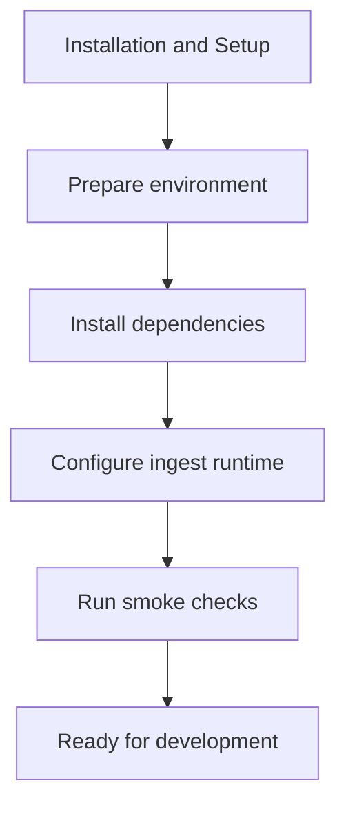

# Installation and Setup

Installation for `bijux-canon-ingest` should start from the package metadata and the specific
optional dependencies that matter for the work being done.

This page exists to keep setup honest. A maintainer should be able to tell which
files actually define installation truth and which dependencies are merely
present in the environment for unrelated reasons.

Treat the operations pages for `bijux-canon-ingest` as the package's explicit operating memory. They should make common tasks repeatable without relearning the workflow from logs or oral history.

## Visual Summary

## Package Metadata Anchors

- package root: `packages/bijux-canon-ingest`
- metadata file: `packages/bijux-canon-ingest/pyproject.toml`
- readme: `packages/bijux-canon-ingest/README.md`

## Dependency Themes

- pydantic
- msgpack
- numpy
- fastapi
- uvicorn
- PyYAML

## Concrete Anchors

- `packages/bijux-canon-ingest/pyproject.toml` for package metadata
- `packages/bijux-canon-ingest/README.md` for local package framing
- `packages/bijux-canon-ingest/tests` for executable operational backstops

## Use This Page When

- you are installing, running, diagnosing, or releasing the package
- you need repeatable operational anchors rather than architectural framing
- you are responding to package behavior in local work, CI, or incident pressure

## Decision Rule

Use `Installation and Setup` to decide whether a maintainer can repeat the package workflow from checked-in assets instead of memory. If a step works only because someone already knows the trick, the workflow is not documented clearly enough yet.

## What This Page Answers

- how `bijux-canon-ingest` is installed, run, diagnosed, and released in practice
- which checked-in files and tests anchor the operational story
- where a maintainer should look first when the package behaves differently

## Reviewer Lens

- verify that setup, workflow, and release statements still match package metadata and current commands
- check that operational guidance still points at real diagnostics and validation paths
- confirm that maintainer advice still works under current local and CI expectations

## Honesty Boundary

This page explains how `bijux-canon-ingest` is expected to be operated, but it does not replace package metadata, actual runtime behavior, or validation in a real environment. A workflow is only trustworthy if a maintainer can still repeat it from the checked-in assets named here.

## Next Checks

- move to interfaces when the operational path depends on a specific surface contract
- move to quality when the question becomes whether the workflow is sufficiently proven
- move back to architecture when operational complexity suggests a structural problem

## Purpose

This page tells maintainers where setup truth actually lives for the package.

## Stability

Keep it aligned with `pyproject.toml` and the checked-in package metadata.
