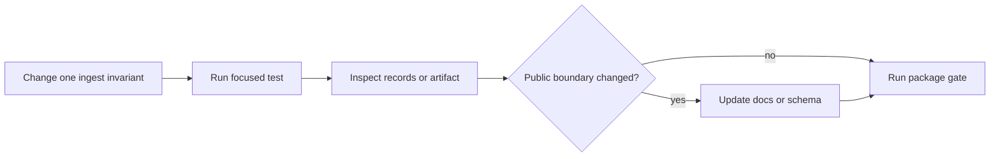

# Local Development

Develop ingest from the transformation contract outward. The fastest useful
loop identifies which prepared record can change, runs the smallest executable
proof for that invariant, and inspects the resulting identifiers or artifacts
before widening validation.



## Bootstrap from the repository root

```bash
make install
make -f "$PWD/makes/packages/bijux-canon-ingest.mk" \
  -C packages/bijux-canon-ingest help
```

Repository setup materializes `packages/bijux-canon-ingest/.venv` as a stable
alias to `artifacts/bijux-canon-ingest/venv`; the environment itself remains in
the artifact tree. Root dispatch keeps repository configuration and output
routing intact:

```bash
make test PACKAGE=bijux-canon-ingest
make lint PACKAGE=bijux-canon-ingest
make quality PACKAGE=bijux-canon-ingest
```

Do not use `make -C packages/bijux-canon-ingest <target>` without the profile
path: the package directory intentionally has no standalone Makefile. A direct
profile path must be absolute because Make changes directory before resolving
`-f`.

## Run a focused proof first

After the package environment exists, run the narrow test file or node that
owns the changed behavior:

```bash
packages/bijux-canon-ingest/.venv/bin/python -m pytest \
  packages/bijux-canon-ingest/tests/unit/<test-file>.py -q
```

Choose the proof by affected contract:

| Changed behavior | Inspect and test |
| --- | --- |
| cleaning or validation | normalized fields, rejected input, stable document identity |
| chunking | offsets, overlap, tail policy, order, and chunk identity |
| embedding | model descriptor, dimension, normalization, cache provenance, failure path |
| local retrieval | corpus fingerprint, metric, stable rank order, citations, persisted codec |
| streaming or retry | order restoration, backpressure, cancellation, error classification |
| CLI | exit status, structured output, path behavior, and artifact bytes |
| HTTP | request rejection, response schema, OpenAPI drift, and process-local index lifetime |

When a transform changes content or identity, inspect an emitted JSONL or
MessagePack artifact rather than relying only on object assertions. A green
unit test cannot reveal an undocumented wire change by itself.

## Validate public boundaries deliberately

Use the API lane only for request, response, handler, or schema changes:

```bash
make api PACKAGE=bijux-canon-ingest
```

The ingest profile uses the live-contract API mode. The lane compares the
application-generated document with `apis/bijux-canon-ingest/v1/schema.yaml`
and exercises the configured HTTP contract. A passing schema parser without
application drift evidence is not equivalent.

Use `make docs-check` for handbook changes. Use the package build when imports,
package data, entry points, or distribution metadata changed:

```bash
make build PACKAGE=bijux-canon-ingest
```

Generated reports, caches, local indexes, and diagnostic runs belong under
`artifacts/`. Do not place them beside source modules or documentation.

## Inspect The Artifact Tree

| Path | Expected evidence |
| --- | --- |
| `artifacts/bijux-canon-ingest/test/` | pytest, coverage, and test cache output |
| `artifacts/bijux-canon-ingest/api/` | generated OpenAPI, drift, and contract-test output |
| `artifacts/bijux-canon-ingest/build/` | wheel, source distribution, and Twine validation log |
| `artifacts/bijux-canon-ingest/sbom/` | production and development dependency documents |

The presence of a directory is not a verdict. Inspect the target status and
the expected non-empty file before reporting evidence.

## Finish with reconstructable evidence

Record the input identity, resolved preparation configuration, emitted
artifact fingerprint, and exact focused checks. If retrieval behavior changed,
retain the evaluation corpus and result comparison. If a rejected input now
succeeds—or a formerly valid input is refused—update the relevant failure and
interface documentation in the same change.

See [change validation](../quality/change-validation.md) for risk-to-check
routing and [release and versioning](release-and-versioning.md) for changes that
alter published expectations.
