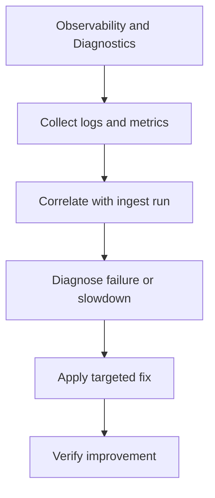

# Observability and Diagnostics

Diagnostics should make it easier to explain what `bijux-canon-ingest` did, not merely that it ran.

Good diagnostics shorten both incidents and reviews. They give maintainers a
way to connect visible outputs back to the package behavior that produced them.

Treat the operations pages for `bijux-canon-ingest` as the package's explicit operating memory. They should make common tasks repeatable without relearning the workflow from logs or oral history.

## Visual Summary

## Diagnostic Anchors

- normalized document trees
- chunk collections and retrieval-ready records
- diagnostic output produced during ingest workflows

## Supporting Modules

- `src/bijux_canon_ingest/processing` for deterministic document transforms
- `src/bijux_canon_ingest/retrieval` for retrieval-oriented models and assembly

## Concrete Anchors

- `packages/bijux-canon-ingest/pyproject.toml` for package metadata
- `packages/bijux-canon-ingest/README.md` for local package framing
- `packages/bijux-canon-ingest/tests` for executable operational backstops

## Use This Page When

- you are installing, running, diagnosing, or releasing the package
- you need repeatable operational anchors rather than architectural framing
- you are responding to package behavior in local work, CI, or incident pressure

## Decision Rule

Use `Observability and Diagnostics` to decide whether a maintainer can repeat the package workflow from checked-in assets instead of memory. If a step works only because someone already knows the trick, the workflow is not documented clearly enough yet.

## What This Page Answers

- how `bijux-canon-ingest` is installed, run, diagnosed, and released in practice
- which checked-in files and tests anchor the operational story
- where a maintainer should look first when the package behaves differently

## Reviewer Lens

- verify that setup, workflow, and release statements still match package metadata and current commands
- check that operational guidance still points at real diagnostics and validation paths
- confirm that maintainer advice still works under current local and CI expectations

## Honesty Boundary

This page explains how `bijux-canon-ingest` is expected to be operated, but it does not replace package metadata, actual runtime behavior, or validation in a real environment. A workflow is only trustworthy if a maintainer can still repeat it from the checked-in assets named here.

## Next Checks

- move to interfaces when the operational path depends on a specific surface contract
- move to quality when the question becomes whether the workflow is sufficiently proven
- move back to architecture when operational complexity suggests a structural problem

## Purpose

This page points readers toward the package's observable output and diagnostic support.

## Stability

Keep it aligned with the package modules and artifacts that currently support diagnosis.
