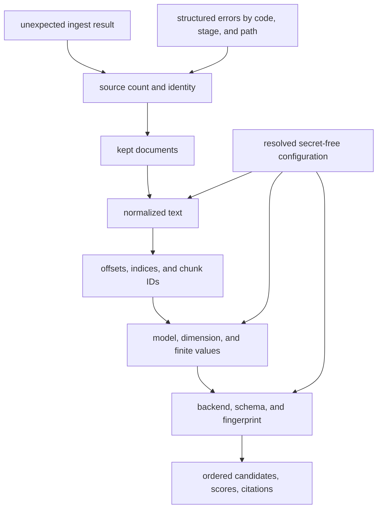

# Observability and Diagnostics

Diagnose ingest from source identity toward the first divergent stage. Counts,
bounded samples, structured errors, resolved configuration, and artifact
fingerprints are stronger evidence than an unstructured success log.

## Diagnostic path

```mermaid
flowchart TD
    symptom["unexpected ingest result"] --> source["source count and identity"]
    source --> keep["kept documents"]
    keep --> clean["normalized text"]
    clean --> chunks["offsets, indices, and chunk IDs"]
    chunks --> vectors["model, dimension, and finite values"]
    vectors --> index["backend, schema, and fingerprint"]
    index --> query["ordered candidates, scores, citations"]

    errors["structured errors by code, stage, and path"] --> source
    config["resolved secret-free configuration"] --> clean
    config --> vectors
    config --> index
```

Stop at the first stage whose evidence differs. Later symptoms are often
consequences: an incoherent ranking can originate in changed normalization,
chunk geometry, model identity, or index/chunk mismatch.

## Built-in signals

| Surface | Evidence |
| --- | --- |
| `Observations` | total documents and chunks, optional kept/cleaned counts, bounded document-ID and chunk-start samples, warnings |
| `IngestTrace` | per-stage count and bounded prefix sample for documents, cleaned documents, chunks, and embedded chunks |
| `DebugConfig` | selective document, kept, cleaned, chunk, embedded, and chunk-probe tracing |
| `IngestTaps` | observation-only callbacks for stage values and named extra surfaces |
| stream helpers | thread-safe item counter, bounded sliding-window peek, and observation taps |
| safeguard reports | error totals grouped by code, stage, and path with bounded examples |
| CLI and HTTP errors | interface-specific input, configuration, missing-index, and adapter failures |
| evaluation output | recall-at-k, query count, baseline comparison, and regression status |

`TraceLens` counts every observed item but retains only a bounded prefix
(default five). This makes it useful for cardinality and early-stage examples,
not for proving properties about every record. Increase sampling deliberately;
full source and vector payloads can be large or sensitive.

## Observation must not alter execution

`IngestTaps`, `trace_iter`, counters, and peeks yield the original values. Tap
callbacks may log or collect metrics but must not mutate inputs or influence
selection. `make_tap` can propagate or suppress callback failure; select that
policy consciously because propagating turns an observability failure into a
pipeline failure, while suppression requires its own alert.

Compare an instrumented run with an uninstrumented run when introducing a new
tap. Chunk IDs, ordering, result classification, and artifact fingerprints
must remain equal.

## Symptom routing

| Symptom | Inspect first | Evidence that resolves it |
| --- | --- | --- |
| fewer documents than expected | source reader and keep predicate | source count, kept count, structured rejection groups |
| changed chunks | cleaning rule order and `RagEnv` | normalized sample, offsets, indices, tail policy, chunk IDs |
| embedding rejection | embedder boundary | model, dimension, metric, normalization, finite-value check, last adapter error |
| duplicate or missing records | source identity and structural dedup | ordered pre/post-dedup IDs and offsets |
| index cannot load | codec and paired artifact | schema version, backend, corpus fingerprint, embedding specification |
| weak or changed ranking | preparation before scoring | corpus/index identity, query, filters, ordered scores, evaluation result |
| HTTP index disappears | process lifecycle | worker/process identity and index-build event |
| memory growth | retained samples, buffers, vectors, or registry | counts, configured bounds, vector rows × dimension, live index inventory |

## Incident evidence set

Retain the smallest reproducible set:

- one failing source record or a controlled corpus snapshot;
- resolved cleaning, predicate, chunk, embedder, and backend configuration;
- observations and bounded trace samples at the first divergent stage;
- complete structured error groups, including counts beyond retained samples;
- package, dependency, and model versions;
- chunk or index artifact with schema and fingerprint; and
- query/evaluation input plus ordered output when retrieval is involved.

Prefer identifiers, counts, offsets, and hashes in shared diagnostics. Source
text, embeddings, citations, exception causes, and provider responses can
contain confidential material and need the same access controls as artifacts.

Use [failure recovery](failure-recovery.md) after locating the first divergent
stage. [Performance and scaling](performance-and-scaling.md) explains which
signals identify a genuine bottleneck rather than a data-contract change.
