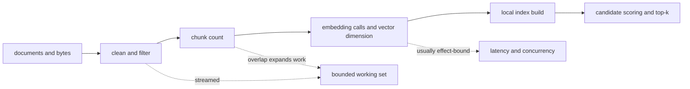

# Performance and Scaling

Ingest performance is governed by corpus size, normalized text length, chunk
geometry, embedding cost, and the selected local retrieval backend. Optimize
the first saturated stage while preserving source order, chunk identity,
structured failures, and artifact fingerprints.

## Cost path

## Scaling dimensions

| Dimension | Primary effect | Control |
| --- | --- | --- |
| document count and text length | cleaning and chunk traversal | stream records; avoid collecting the complete corpus between pure stages |
| chunk size | chunks per document, retrieval granularity, and embedding payload | choose from evidence needs, not throughput alone |
| overlap | duplicates text across neighboring chunks | keep below chunk size and measure the resulting expansion |
| embedding dimension | vector memory, serialization size, and cosine work | pin `EmbeddingSpec`; do not change dimension behind an artifact identity |
| embedding provider | latency, batching opportunity, rate limits, and retries | bound concurrency and record model/provider behavior |
| BM25 corpus | token postings and exact lexical scoring | use for deterministic local corpora that fit the process budget |
| NumPy-cosine corpus | dense matrix memory and query-time vector scoring | estimate rows × dimension × numeric width before building |
| `top_k` and reranking | candidate materialization and secondary work | cap at the application boundary and retain ranking configuration |

Overlap has a multiplicative cost. Reducing chunk size while retaining a large
overlap can increase chunk count, embedding calls, index rows, and query work
at once. A faster configuration that changes chunk boundaries is a different
data contract, not a transparent optimization.

## Streaming and concurrency

`stream_chunks`, `gen_stream_embedded`, and order-preserving structural dedup
operate lazily. `gen_bounded_chunks` places a hard fence on emitted chunks.
Async stream helpers add bounded mapping, gathering, fairness, rate limiting,
and bounded buffers for effectful integrations.

Use ordered bounded mapping when downstream identity depends on encounter
order. Completion-order output can improve latency for independent work but
changes observable order and must be followed by an explicit restoration step
when order is contractual.

Concurrency belongs around independent effectful work such as remote
embedding. Pure cleaning and chunking are deterministic and usually benefit
more from streaming than from uncontrolled task creation. Size concurrency
against provider quotas, connection pools, memory held per request, and the
maximum number of pending results—not CPU count alone.

## Memory posture

The lazy pipeline can keep transformation memory bounded, but several choices
materialize state:

- trace samples retain up to their configured limits;
- error aggregation retains counts plus bounded samples when configured;
- local indexes retain corpus metadata, token structures, or dense vectors;
- HTTP v1 retains built indexes in process memory;
- evaluation retains the inputs and result state required by its workflow.

Set document, corpus, chunk-count, vector-dimension, and index-size ceilings in
the hosting application. A process-local HTTP registry is unsuitable as the
only state layer when worker count or corpus size must scale independently.

## Measurement contract

Measure stages separately: documents read, documents kept, normalized bytes,
chunks emitted, embedding calls, vectors written, index build time, query
latency, and retrieval quality. Report corpus identity, package version,
resolved configuration, model/backend identity, machine posture, warm or cold
cache state, and concurrency with every benchmark.

Throughput is acceptable only when the resulting chunk IDs and fingerprints
match the intended contract. For retrieval changes, pair latency and memory
with the evaluation suite's recall-at-k result; a faster index with an
unexplained quality regression is not equivalent.

See [observability and diagnostics](observability-and-diagnostics.md) for the
signals available during measurement and [configuration](../interfaces/configuration-surface.md)
for settings that change artifact meaning.
