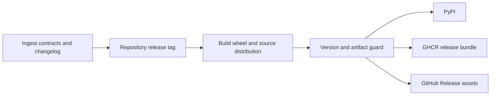

# Release and Versioning

`bijux-canon-ingest` is released from the repository-wide `v<version>` tag.
Hatch VCS derives the distribution version from Git history; the package does
not maintain an independent hard-coded release number.



## What constitutes an ingest release change

Version impact is determined by caller-visible meaning, not file count.

| Changed surface | Release significance |
| --- | --- |
| root import, CLI command, HTTP schema, or wire codec | public interface change |
| cleaning, chunk offsets, ordering, tail policy, or deduplication | prepared-data contract change |
| document, chunk, corpus, or index fingerprint inputs | identity and replay change |
| embedder descriptor, dimension, normalization, or cache key | vector compatibility change |
| ranking, citation, or evaluation tolerance | local retrieval behavior change |
| dependency or supported Python range | installation and deployment change |

Add the user-visible consequence to
`packages/bijux-canon-ingest/CHANGELOG.md`. State whether existing prepared
records or local indexes remain loadable and whether rebuilding them is
required.

## Version derivation and guards

The package's `pyproject.toml` uses Hatch VCS with the repository `v*` tag
pattern. Untagged or dirty checkouts can produce development or local version
segments. Publication guards reject prerelease and local versions unless the
release workflow explicitly opts into them, and verify that wheel and source
distribution filenames match the resolved version.

Changing only the fallback version does not create a release. The tagged Git
commit, built metadata, changelog entry, and published artifacts must agree.

## Focused release evidence

From the repository root:

```bash
make test PACKAGE=bijux-canon-ingest
make lint PACKAGE=bijux-canon-ingest
make quality PACKAGE=bijux-canon-ingest
make api PACKAGE=bijux-canon-ingest
make build PACKAGE=bijux-canon-ingest
```

Run only the lanes affected by the change while developing; the release
coordinator supplies the broader publication gates. Before approving an ingest
release, inspect the built wheel and source distribution for:

- `bijux_canon_ingest`, `py.typed`, and the canonical console entry point;
- the repository license and package README;
- the expected version without a `dirty` or unintended prerelease marker; and
- package data needed by codecs or interfaces.

## Publication identity

The same staged distributions feed PyPI and the package's release bundle. The
GitHub Release receives package-prefixed assets so files from all repository
distributions remain distinguishable. GHCR contains a release bundle, not a
separate implementation of ingest.

The `bijux-rag` compatibility distribution is released from the same source
line, but new behavior begins in `bijux-canon-ingest`. Compatibility code must
delegate rather than define another preparation contract.

A release is incomplete when the package installs successfully but readers
cannot determine whether their sources, chunks, embeddings, or indexes require
regeneration.
