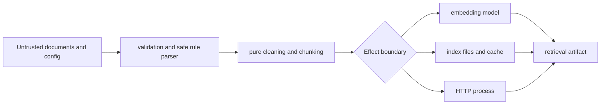

# Security and Safety

Ingest processes untrusted text, reads and writes local artifacts, optionally
loads external models, and can expose a network adapter. Its pure transforms
have limited authority; file, model, cache, and HTTP boundaries require the
operator's security policy.

## Trust boundaries

## Input and rule safety

- Bound document size and corpus size at the application boundary. The library
  cannot infer an acceptable memory or latency budget for a deployment.
- Validate stable document identifiers and avoid placing credentials or
  sensitive content in identifiers, error context, or logs.
- Keep chunk count bounded for streamed or adversarial input. The bounded
  streaming helpers and error-rate breakers exist for this purpose.
- Dynamic rule expressions use a small AST whitelist. Only approved document
  attributes, comparisons, boolean operations, `len`, `startswith`, and
  `lower` are accepted. Do not replace that parser with unrestricted `eval`.

## Artifact safety

Local BM25 and cosine indexes use MessagePack, not executable pickle payloads.
They are still untrusted structured input: validate origin, access control,
size, schema, backend name, embedding specification, and fingerprint before
loading or serving them.

Write output and disk-cache directories with least privilege. A caller chooses
paths, so the package does not provide tenant isolation or prevent one caller
from overwriting another caller's artifact. Namespace caches by contract and
version, and never use raw source text or secrets as a filename.

## Model and dependency boundaries

The sentence-transformer adapter can download or load model assets and executes
code from its dependency stack. Pin model identity and package versions,
control the model cache, and apply the organization's model provenance policy.
Use `hash16` only where its non-semantic behavior is acceptable.

Retry external adapters only for classified transient failures. Bound attempts,
delay, concurrency, and in-flight work. Circuit breakers should protect model
and storage boundaries; applying them to pure stages can hide deterministic
data defects.

## HTTP deployment

The packaged FastAPI adapter has no built-in authentication, authorization,
tenancy, durable index store, or production request-limiting policy. Bind it to
a trusted interface for local use or place it behind an application gateway
that supplies those controls. Treat an `index_id` as process-local capability,
not as a durable or globally unique authorization token.

Avoid returning raw source text, embeddings, or exception causes unless the
caller is authorized to see them. Citation spans can disclose source content
even when the final answer appears harmless.

## Abuse cases and response evidence

Exercise the failure path before accepting a deployment that handles
untrusted material:

| Abuse case | Required control | Evidence to retain |
| --- | --- | --- |
| oversized document or decompression/record expansion | byte, record, chunk, elapsed-time, and in-flight bounds before expensive stages | limit, observed size, rejected identity, and typed failure |
| crafted rule expression | AST whitelist and refusal before evaluation | expression digest, rejected node/operator, and stable error class |
| index file with invalid dimensions or forged metadata | schema, backend, embedding specification, fingerprint, and size validation before allocation/use | artifact identity and exact failed invariant |
| cache collision across model or configuration | namespace includes contract, model, parameters, and version identity | cache key inputs and hit/miss decision without source text |
| model download or cache substitution | controlled source, pinned asset identity, restricted cache, and offline policy where required | package, model, asset digest, source, and load mode |
| caller-selected output path crosses a trust domain | process isolation, approved root, ownership, and least-privilege permissions | resolved destination and authorization decision |
| retrieval or HTTP response exposes source bytes | caller authorization and field-level disclosure policy | caller/scope decision and redacted response metadata |
| repeated transient adapter failures exhaust resources | bounded retry, concurrency limit, breaker state, and final typed failure | attempt count, timings, classification, and breaker transition |

Do not discard rejected inputs from the audit merely because no output was
produced. Their stable identity, limit decision, and failure class demonstrate
that the boundary refused them for the intended reason. Store sensitive source
bytes only when policy requires them; a digest and protected quarantine
reference are preferable for routine rejection records.

## Deployment acceptance

Before enabling a file, model, cache, or HTTP effect boundary, verify that the
service identity can read only approved inputs and write only its artifact and
cache roots; network egress reaches only approved model/services; secrets stay
outside configuration and traces; logs are disclosure-reviewed; and recovery
cannot publish a partial index as complete. Run one denial case for each
granted boundary and confirm that downstream packages never receive an
artifact from the refused attempt.

## Safe operating posture

For a governed ingest run, retain source identity, resolved configuration,
model and dependency identity, structured rejection report, artifact
fingerprint, and retrieval evaluation. Separate sensitive artifacts from
public logs and documentation. Downstream success does not erase a rejected
source or weaken the need to preserve its failure evidence.
