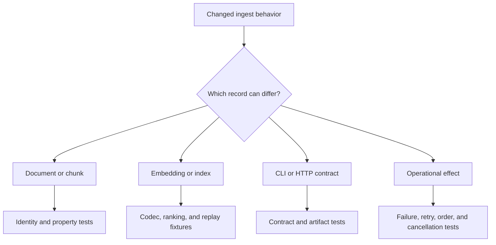

# Change Validation

Validate an ingest change against the first durable record whose meaning can
change. Source preparation defects propagate into every downstream package, so
the most valuable proof is usually an identity, span, ordering, serialization,
or failure assertion near the transformation that moved.



## Risk-to-evidence matrix

| Risk | Required focused evidence |
| --- | --- |
| normalization changes silently | golden normalized record plus content-identity assertion |
| chunk boundaries drift | property tests for spans, overlap, tail policy, order, and reconstruction |
| invalid input is coerced | strict rejection test with stable error classification |
| embedding artifacts become incompatible | descriptor, dimension, normalization, and load rejection tests |
| local index bytes drift | round-trip, schema, corpus fingerprint, and tamper tests |
| ranking becomes unstable | fixed corpus/query fixture with score and tie-order assertions |
| concurrency changes order | bounded execution and restored-order tests under failure |
| retry duplicates effects | idempotency and attempt-evidence tests |
| CLI representation diverges | exit status, JSON shape, and file-content tests |
| HTTP contract drifts | OpenAPI comparison plus positive and rejected request cases |

## Select the narrowest useful command

Use a focused pytest node during development, then the package dispatcher for
the completed unit:

```bash
packages/bijux-canon-ingest/.venv/bin/python -m pytest \
  packages/bijux-canon-ingest/tests/<area>/<test-file>.py -q

make test PACKAGE=bijux-canon-ingest
```

Add the relevant boundary lane when the risk crosses it:

```bash
make api PACKAGE=bijux-canon-ingest      # HTTP or OpenAPI
make lint PACKAGE=bijux-canon-ingest     # source, tests, typing surface
make quality PACKAGE=bijux-canon-ingest  # dependency and code-health posture
make build PACKAGE=bijux-canon-ingest    # imports, entry points, package data
make docs-check                          # reader-facing contract
```

Do not run every repository lane merely to compensate for an unclear change.
If the changed invariant cannot be named, clarify the boundary before choosing
more checks.

## Inspect artifacts, not only assertions

For serialization or retrieval changes, retain one representative prepared
record, index, result, or evaluation report under `artifacts/` and inspect its
identity-bearing fields. Tests should prove that incompatible historical
artifacts fail explicitly rather than loading with altered meaning.

Document changed guarantees and limitations beside the public surface. A test
that proves new behavior while the handbook promises the old behavior is a
documentation failure, not complete validation.

Validation is sufficient when it explains which ingest invariant changed,
shows the nearest executable evidence, and makes every affected downstream
assumption visible.
